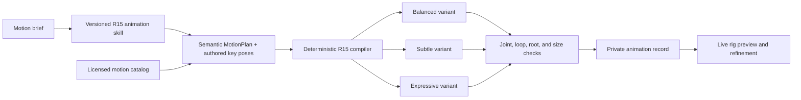
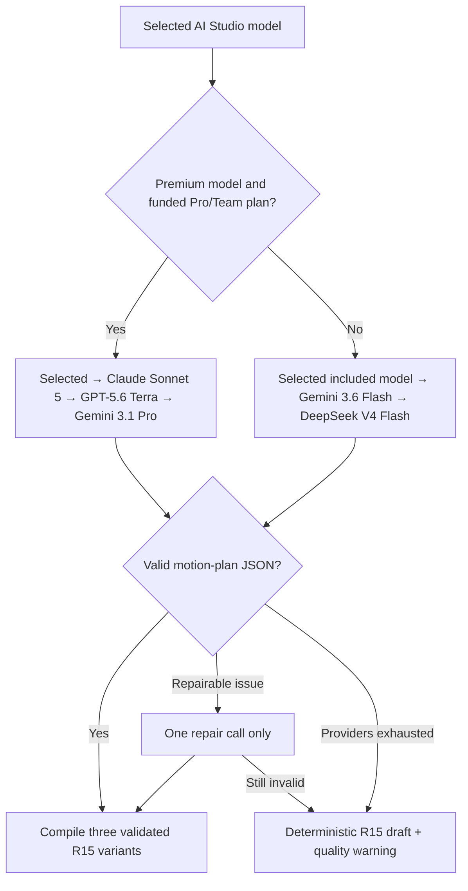
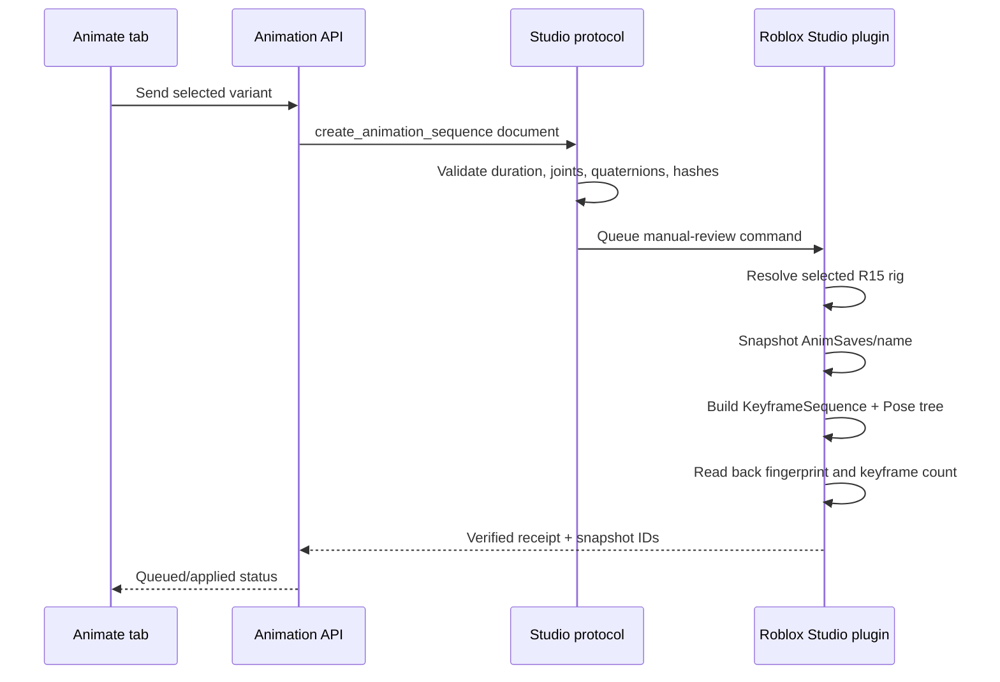
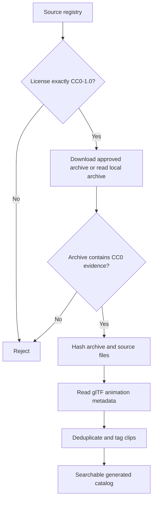

# NexusRBX AI Animation v1

The Animate tab is a prompt-first R15 motion workflow. An AI planner interprets intent, style, phases, and authors bounded key poses for the requested action. A deterministic compiler samples those poses, creates variants, converts rotations to normalized quaternions, and enforces limits. Procedural archetypes remain as reliable fallbacks, not as the ceiling of what users can request. Studio receives only the validated animation document and constructs native Roblox animation instances.

## Generation flow



The AI Studio picker controls animation authoring. The R15 preview selector controls only visualization. Every generation and refinement sends the current `modelVersion`; the server resolves that selection against the authenticated plan and available Premium Balance.



Responses and saved animation history include `modelRouting.requested`, `resolved`, `fallbackUsed`, `attempts`, `repaired`, and `deterministicFallback`. The results panel discloses substitutions instead of silently changing models. `ANIMATION_PLANNER_MODEL` is consulted only when an interactive model selection was not supplied.

The model never emits Lua, Studio paths, asset IDs, quaternions, or raw executable commands. Its output is the semantic `MotionPlan` defined in `backend/src/skills/roblox-r15-animation/references/motion-plan-schema.md`. Arbitrary actions use 3–12 normalized-time R15 poses; the compiler clamps Euler rotations, interpolates them, and produces the final animation document.

## Studio apply flow



The active Studio protocol is `2026-08-27-r15-animation`; the matching plugin is `0.14.0-r15-animation`.

## Motion library ingestion



Run from `backend/`:

```powershell
npm run animations:sync-cc0
```

For a source whose author requires an interactive download, obtain the original archive from the author page and import it explicitly:

```powershell
node scripts/syncCc0AnimationLibrary.js --local quaternius-ual2-free=C:\path\to\archive.zip
```

The first unattended sync imports 46 distinct CC0 glTF clips from the free Quaternius Universal Animation Library mirror. The registry's target is 150 base clips. It reports `targetReached: false` until additional original CC0 archives are explicitly supplied; it never inflates the count with generated variants or unverified mirrors.

## Main implementation surfaces

- `src/pages/ai/AnimateWorkspace.jsx`: prompt, new-animation chat reset, preview-model selection/import, refinement, variants, timeline, and Studio review.
- `src/pages/ai/animation/R15Preview.jsx`: live quaternion interpolation on the rigged R15 GLB.
- `backend/src/skills/roblox-r15-animation/`: versioned product skill and source-backed authoring contract.
- `backend/src/services/animation/`: planning, deterministic compilation, catalog search, persistence, Studio dispatch.
- `backend/src/routes/animations.js`: authenticated generation, refinement, library, retrieval, and Studio routes.
- `backend/src/lib/studioToolProtocol.js`: strict `create_animation_sequence` trust boundary.
- `roblox-plugin/src/commands/animation.lua`: native `KeyframeSequence` creation, snapshots, conflict checks, and readback fingerprinting.
