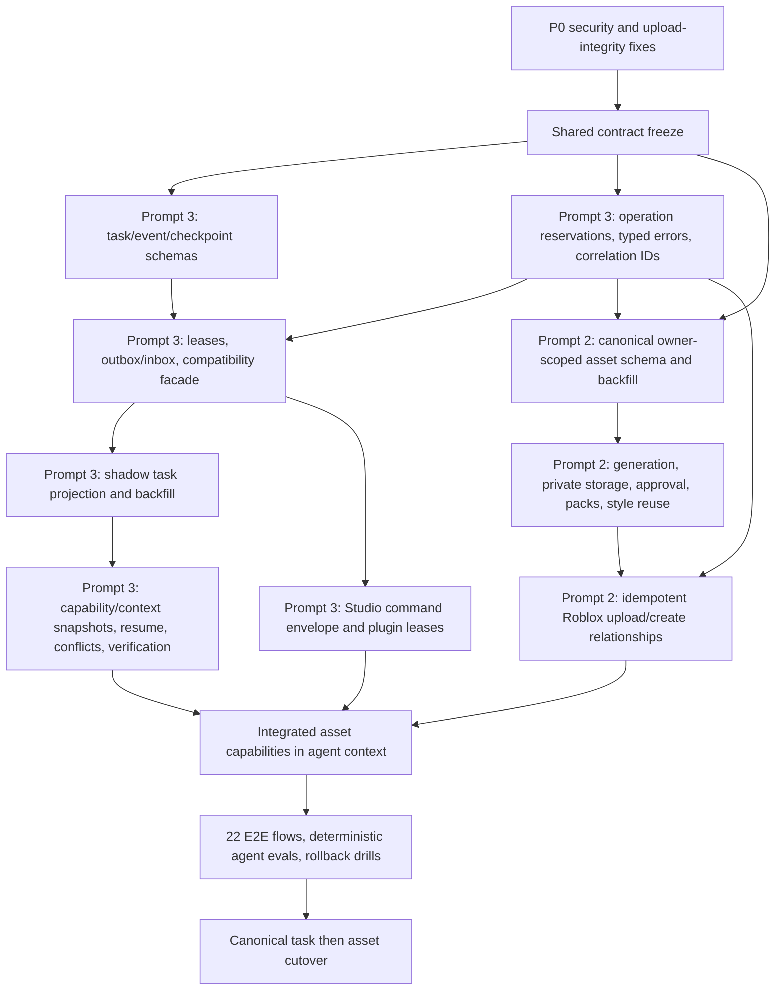

# Migration, ownership, and implementation sequence

## Status, evidence, and decision

This is a documentation-only migration design. It does not create collections, deploy indexes, change Firestore documents, enable a feature flag, or authorize an external Roblox operation. **Confirmed**, **Strong inference**, and **Unknown** have the meanings defined in [README.md](./README.md). Every collection or flag explicitly labelled **Proposed** is a target design, not a claim about the current deployment.

The recommended implementation is an additive convergence, not a rewrite:

1. Prompt 3 owns the shared task, event, checkpoint, operation, capability, error, and verification foundation.
2. Prompt 2 owns the canonical asset domain, asset providers, moderation/upload behavior, and asset-facing UI, using that foundation.
3. Existing jobs, runs, manifests, receipts, and asset records remain readable during backfill and shadow comparison.
4. No legacy record is deleted or destructively rewritten by the migration. External side effects are never replayed merely because a backfill or cutover is retried.
5. Prompt 2 is not ready for a full production launch until the P0 authorization and upload-reuse defects in [README.md](./README.md#highest-risk-confirmed-root-causes) are closed and the operation ledger is enforced.

## 1. Confirmed current persistence baseline

The following is the current repository state. It is intentionally separated from the proposed target so future collection names are not mistaken for deployed behavior.

| Current concern | Confirmed store or control | Current behavior relevant to migration | Evidence |
| --- | --- | --- | --- |
| Artifact jobs | `_jobs/{jobId}` | `JobService` owns the job projection and offloads large fields to Storage. | **backend/src/services/JobService.js:167-220,265-280** |
| Job events | `_jobs/{jobId}/events/{eventId}` | Event sequence allocation and event creation are transactional, but the event stream is subordinate to job-specific terminal semantics. | **backend/src/services/JobService.js:261-262,343-375** |
| Request idempotency | `_idempotency/{key}` | Read and write are separate service calls rather than a single create/reserve transaction. | **backend/src/services/JobService.js:169-170,474-487**; **backend/src/routes/ai.js:812-878** |
| Unified agent runs | `_agentRuns/{runId}` with `steps` | A run links to a job but remains a separate authority. | **backend/src/services/AgentRunService.js:96-102,115-140** |
| Iterative Studio runs | `_studioAgentRuns/{runId}` with `steps` | A second run model links to a job and owns iterative-agent state. | **backend/src/services/StudioAgentService.js:654-667,1004-1034** |
| Studio transport | `_studioPairCodes`, `_studioSessions`, `_studioCommands`, `_studioSnapshots` | Pairing, session liveness, commands, and snapshots are persisted separately from jobs/runs. | **backend/src/services/StudioBridgeService.js:391-403** |
| Studio manifests | `_studioManagedFiles`, `_studioProjectManifests`, manifest items/pages/revision caches/revisions | Manifest schema version is `2`; IDs for manifests, items, pages, caches, revisions, and queued steps are derived deterministically. | **backend/src/services/StudioManifestService.js:5,94-151,296-302** |
| UI project state and assets | `users/{uid}/uiProjects/{projectId}` with `screens` and `assets` | Project revisions and compact snapshots exist; project asset records are project-local. | **backend/src/lib/projectState.js:1-12,42-130,182-257** |
| Asset ontology | Global `genreProfiles`, `styleProfiles`, `masterAssets`, `assetGenerations`, `robloxAssetBindings`, `assetUsageEvents`, `catalogPromotions`, `assetPacks`; project-local `projectAssetReferences` and `assetFamilies` | Asset truth and ownership shape differ from the other asset stores. Organization membership is checked only by selected paths, not by the collection layout itself. | **backend/src/services/AssetOntologyService.js:489-520** |
| Chat/project asset context | `users/{uid}/chats/{projectId}/project/current`, `project_asset_attachments`, and `generated_asset_uploads` | The AI workspace has another project/asset representation. | **backend/src/services/ProjectAssetService.js:190-203** |
| Retention projects | `users/{uid}/projects/{projectId}`, `project_idempotency`, and project `versions` | This service already derives a stable idempotency document ID from user and key. It is not the task/asset authority. | **backend/src/services/RetentionProjectService.js:82-87,211-221** |
| Roblox receipts | `users/{uid}/robloxOperations/{receiptId}` | A receipt may use a caller ID or random document ID; reuse is found by querying `idempotencyKey`. | **backend/src/services/RobloxOperationReceiptService.js:13-65** |
| Other asset/output projections | User `workspace_artifacts`, `artifacts`, `robloxModelUploads`, and `robloxModelInsertions`; global worker `artifacts` | These are migration inputs, not enough by themselves to prove one canonical asset or task outcome. | **backend/src/services/WorkspaceArtifactService.js:27**; **backend/src/services/RobloxModelUploadService.js:61**; **backend/src/services/RobloxModelInsertionService.js:59**; **backend/src/routes/artifacts.js:14-75**; **backend/src/workers/generateArtifactWorker.js:572** |
| Redis or in-memory security store | Prefixed scalar keys and transient streams | `securityStore` backs fixed-window controls, expiring locks/values, and bounded streams. `JobStreamService` publishes transient job events through it; production requires `REDIS_URL`, while non-production may use the process-local fallback. It is not durable task or operation authority. | **backend/src/lib/securityStore.js:20-93,95-197**; **backend/src/services/JobStreamService.js:1-33** |
| Prisma/PostgreSQL | `User`, `UsageLog`, and `PaygCredit` | The checked-in SQL schema covers identity, plan/usage accounting, and credits; `UsageLog.jobId` is an optional unique correlation field. Repository evidence does not prove which migrations or rows are deployed, and this schema is not a current task or asset authority. | **backend/prisma/schema.prisma:1-43** |
| Current index manifest | `backend/firestore.indexes.json` | Composite indexes cover current manifest, icon, Studio-session, and other current queries. No task/operation/canonical-asset index set proposed below exists in this file. | **backend/firestore.indexes.json:3-158** |
| Worker and rollback controls | `RUN_JOB_WORKER`, `STUDIO_ITERATIVE_AGENT_ENABLED`, `STREAM_EVENT_PERSISTENCE_ENABLED`, `STUDIO_PREFLIGHT_FROM_SCRATCH_ENABLED` | The job worker is opt-in per process; iterative Studio routing defaults on and has an existing rollback flag. | **backend/server.js:63-66,241-255**; **backend/src/services/artifactRunLauncher.js:26-27,95-100**; **backend/.env.example:116-147** |

**Confirmed:** `artifactRunLauncher` collects OAuth and project-asset context into the job at **backend/src/services/artifactRunLauncher.js:135-189**, but passes a smaller branch-specific input into `StudioAgentService.createRun` or `AgentRunService.createRun` at **backend/src/services/artifactRunLauncher.js:209-245**. This is why backfill can correlate existing data but cannot treat either run shape as the complete future context snapshot.

**Unknown until production inventory:** document counts and sizes, orphan rates, duplicate external IDs, missing owner/project/universe fields, Storage object existence, deployed index status, retention/TTL policies, and the number of terminal jobs whose Studio outcome is unresolved. Migration code must measure these before setting a cutover date.

### 1.1 Current browser and Studio-local persistence

These stores affect continuity and migration diagnostics, but none is a safe server-side task, operation, asset, or authorization authority.

| Surface and current API | Data currently retained | Durability and authority boundary | Evidence |
| --- | --- | --- | --- |
| Browser Firestore IndexedDB cache | Previously read Firestore documents, coordinated across tabs | Durable across ordinary refreshes and useful for listener recovery, but only a client cache of Firestore state. It cannot prove a completed write or external side effect. | **src/firebase.js:127-144** |
| Browser generation and authentication handoff | Generation intent in `sessionStorage`; pending auth action in `localStorage`; auth and email-verification return paths in `sessionStorage` | Expiring or browser-local UX continuity. Loss may interrupt navigation, but these values never authorize a server action. | **src/lib/generationIntent.js:1-141**; **src/lib/pendingAuthAction.js:1-76**; **src/lib/firebaseAuth.js:40-87**; **src/pages/VerifyEmailPage.jsx:8-34** |
| Browser workspace settings and command continuity | Studio apply/enabled preferences, general settings, quick-script session, terminal history, and the current terminal command ID in `localStorage` | Convenience state that may be stale or device-specific. A command ID is a lookup hint, not evidence that the command ran. | **src/lib/agentSteps.js:294-310**; **src/lib/settingsSchema.js:1-5**; **src/context/SettingsContext.jsx:17-29**; **src/lib/quickScriptSession.js:1-52**; **src/pages/ai/AgentWorkspaceLayout.jsx:599-679** |
| Browser chat-progress coordinator | Per-key signature and short lock lease in `localStorage`, with Web Locks when available | Deduplicates/throttles the real persistence callback across tabs. The stored signature and lease are explicitly not the progress source of truth. | **src/lib/chatProgressPersistence.js:35-153** |
| Browser OAuth, billing, checkout, and support continuity | Pending OAuth action, usage counters/cache, checkout intent, support idempotency state, and support draft in `sessionStorage` or `localStorage` | Client continuity and abuse-friction only. OAuth capability, entitlement, payment, and support-ticket truth remain server-owned. | **src/lib/robloxOAuthApi.js:36-98**; **src/lib/billing.js:14-99**; **src/lib/checkoutIntent.js:3-93**; **src/lib/supportApi.js:23-86**; **src/lib/supportDraft.js:1-90** |
| Browser analytics and experiments | Visitor/session IDs, local event buffer, debug settings, assignments, overrides, and exposure markers | Product instrumentation only; it is not an audit log or entitlement authority and can be cleared or edited by the user. | **src/lib/productAnalytics.js:5-192,328-372**; **src/lib/experiments.js:1-223** |
| Studio plugin credential, session, and transport settings | `nexusrbxStudioToken`, session ID, backend URL/dev mode, and auto-pull through `plugin:GetSetting`/`SetSetting` | Device-local plugin settings. The bearer token is sensitive; server session validity and command state must remain authoritative, and reinstall/reset may remove continuity. | **roblox-plugin/src/net/httpClient.lua:13-14,245-249**; **roblox-plugin/src/Main.server.lua:2-4,138,275-292** |
| Studio plugin UI settings | Approval mode, active tab, and onboarding-seen state | Preference/onboarding state only. Approval mode cannot replace server-side risk classification or an explicit approval record. | **roblox-plugin/src/ui/BridgePanel.lua:821,927-942,1383,1486** |
| Studio imported-asset receipt cache | Idempotency-keyed receipts plus insertion order, bounded to 50 entries, through plugin settings | Local replay mitigation only. Eviction, another machine, or reinstall loses it; the target operation ledger must own replay and reconciliation. | **roblox-plugin/src/commands/importedAsset.lua:1-54** |
| Firebase Cloud Storage configuration | Web configuration names `nexusrbx.appspot.com`; the Admin app and asset/job/model services default to `nexusrbx.firebasestorage.app` with environment overrides | Source confirms multiple configuration entry points, not the deployed bucket, rules, encryption, lifecycle, public-object exposure, or object inventory. All of those are **Unknown** until the production inventory verifies them. | **src/firebase.js:15-24**; **backend/src/firebase.js:14-18**; **backend/src/services/JobService.js:52-58**; **backend/src/services/AssetOntologyService.js:1239-1240**; **backend/src/services/RobloxModelUploadService.js:9-14** |

### 1.2 Current identifier and schema duplication

The repository has correlations, but no canonical `taskId`, project binding, asset identity, or operation identity spanning all runtimes. A migration must preserve the original identifier and source kind; it must not infer equality from similar names or reused field labels.

| Identity family | Current duplication or ambiguity | Migration rule | Evidence |
| --- | --- | --- | --- |
| Job and task | `_jobs/{jobId}` is the closest cross-route work record, but there is no canonical persisted `taskId`; job state and events use a generated Firestore ID. | Backfill a new task only with an explicit source pointer and correlation confidence; never rename a `jobId` in place. | **backend/src/services/JobService.js:167-170,261-266** |
| Agent run and step | `_agentRuns/{runId}` and `_studioAgentRuns/{runId}` are independent collections with their own generated run IDs and `steps`; both may point at one job. | Map each legacy run and step to source-qualified IDs, then bind them to one task without collapsing conflicting histories. | **backend/src/services/AgentRunService.js:96-102,115-140**; **backend/src/services/StudioAgentService.js:654-667,1004-1034,1110-1118** |
| Project and chat | `uiProjects/{projectId}`, retention `projects/{projectId}`, and `chats/{projectId}/project/current` use the same field label or chat document position for different schemas. | Create an owner-scoped project binding only when user, chat/project source, and destination facts agree; quarantine ambiguous joins. | **backend/src/lib/projectState.js:8-31,42-60**; **backend/src/services/RetentionProjectService.js:82-87,211-221**; **backend/src/services/ProjectAssetService.js:190-203** |
| Studio project and file | Session/place identity, manifest identity, item identity, revision, canonical path, and optional file/artifact IDs are combined differently across deterministic manifest keys. | Preserve every source key and derive a stable file ID from verified project binding plus canonical path/content history, not from the active session alone. | **backend/src/services/StudioBridgeService.js:400-403,438-468**; **backend/src/services/StudioManifestService.js:94-151** |
| Local project asset | UI project `assets/{assetId}` is project-local, while chat project assets live in `project_asset_attachments` and generated uploads in `generated_asset_uploads`. | Treat these as source records or references until ownership, content hash, and project binding identify a canonical asset/version. | **backend/src/lib/projectState.js:8-31**; **backend/src/services/ProjectAssetService.js:190-203** |
| Asset ontology | `masterAssetId`, `generationId`, and `robloxAssetBindings` are global-domain identifiers, separate from project-local asset IDs and references. | Give the canonical NexusRBX asset its own opaque ID; retain master, generation, binding, and project-reference IDs as typed relationships. | **backend/src/services/AssetOntologyService.js:489-503,661-666,1156-1160** |
| Roblox model lifecycle | `robloxModelUploads/{uploadId}` and `robloxModelInsertions/{insertionId}` introduce more local record IDs alongside provider asset IDs. | Do not overload `assetId`: store NexusRBX asset/version ID, Roblox asset ID/type, upload operation ID, and insertion operation ID in separate fields. | **backend/src/services/RobloxModelUploadService.js:60-74**; **backend/src/services/RobloxModelInsertionService.js:58-69** |
| Command and operation | Studio command IDs are random without an idempotency key and deterministic with one; `robloxOperations/{receiptId}` may use a caller ID or random ID and later queries `idempotencyKey`. Provider request/operation/resource IDs are additional correlations. | Reserve one deterministic semantic operation before dispatch, then retain command, receipt, provider request, provider operation, and resource IDs as non-authoritative evidence. | **backend/src/services/StudioBridgeService.js:96-98,941-1025**; **backend/src/services/RobloxOperationReceiptService.js:13-65** |
| Roblox destination | `placeId`, `universeId`, creator/owner, session, and project relationships are optional or derived in different flows; a shared field value does not prove ownership. | Resolve a versioned owner/universe/place binding server-side and snapshot it into the task/operation before any external write. | **backend/src/services/StudioBridgeService.js:438-468,508-536**; **backend/src/services/RobloxOperationReceiptService.js:21-41** |

## 2. Proposed physical Firestore model

Everything in this section is **Proposed**. The logical contracts and state machines are in [target-architecture-and-contracts.md](./target-architecture-and-contracts.md); this section defines a physical layout that can implement them incrementally.

### 2.1 Server-owned runtime collections

| Proposed path | Purpose and authoritative fields | Write rule |
| --- | --- | --- |
| `_taskReservations/{reservationId}` | Unique root request reservation: `userId`, `rootIdempotencyKey`, `inputHash`, `taskId`, `createdAt`, `schemaVersion` | Create with `_tasks/{taskId}` in one transaction. Same key/different input is a conflict. |
| `_tasks/{taskId}` | Current `Task` projection, including identity, status, context/capability snapshot IDs, `eventSequence`, acceptance policy, final evidence, lease summary, and timestamps | Only a state-transition transaction may update it. Browser and chat documents are consumers. |
| `_tasks/{taskId}/events/{eventId}` | Append-only `TaskEvent`; `eventId` encodes its reserved sequence | Created atomically with the projection transition. Never update or delete; corrections are later events. |
| `_tasks/{taskId}/steps/{stepId}` | Current step projection, dependency IDs, operation/command IDs, retry policy, latest attempt summary | Created from a versioned plan and transitioned transactionally. |
| `_tasks/{taskId}/steps/{stepId}/attempts/{attemptId}` | Normalized attempt history and lease/fence evidence | Append one record per attempt; do not grow an unbounded Firestore array even though the wire contract can present an array. |
| `_tasks/{taskId}/checkpoints/{checkpointId}` | Replay checkpoint through an exact event sequence and source-version set | Immutable after creation; checksum must match the ledger. |
| `_tasks/{taskId}/amendments/{amendmentId}` | Ordered user amendments and superseded step IDs | Append-only; application is recorded by event. |
| `_tasks/{taskId}/inbox/{inboxId}` | Idempotent receipt of provider, Studio, or outbox messages | Deterministic consumer/message key; create in the same transaction as resulting projection updates. |
| `_operations/{operationId}` | Canonical `OperationRecord` for one logical external side effect | Deterministic reservation and transactionally fenced claims. Never create a replacement operation merely because outcome is unknown. |
| `_operations/{operationId}/attempts/{attemptId}` | Attempt-level request, response, provider receipt, and reconciliation summary | Secrets and raw provider payloads are excluded or stored through a private, retention-controlled pointer. |
| `_taskOutbox/{messageId}` | Durable dispatch intent: `topic`, payload/reference, status, lease, attempt count, `availableAt`, `publishedAt` | Written with the source event/state transaction; claimed with a fenced lease. |
| `_capabilitySnapshots/{snapshotId}` | Generic capability availability/authorization snapshot | Server-generated, immutable, expiring; contains facts, never tokens. |
| `_oauthCapabilitySnapshots/{snapshotId}` | Sanitized Roblox owner, universe, place, scope, and connection-version facts | Server-generated from encrypted token state; immutable and expiring. |
| `_agentContextSnapshots/{contextSnapshotId}` | Exact project/manifest/file/asset/task sources supplied to an agent | Immutable, expiring or retention-limited; no full place source and no secrets. |
| `_manifestConflicts/{conflictId}` | Website/Studio/base hashes and explicit resolution | Created on conflict; resolved only by a typed resolution event. |
| `_migrationControl/{migrationId}` and `issues/{issueId}` | Cursor, source high-water mark, counts, checksums, quarantine reason, and dry-run/apply status | Migration-only service identity; production runtime never depends on this collection. |

`_studioSessions`, `_studioCommands`, `_studioSnapshots`, and the current manifest collections remain in place initially. `_studioCommands` receives additive v2 envelope, execution, lease, operation, task, and verification fields only after the plugin and backend negotiate the envelope version. Existing manifest documents remain schema version `2`; a manifest version bump is not justified unless an incompatible persisted shape is introduced.

Worker-only projection fields such as `executor`, `nextActionAt`, `availableAt`, and `lease` are physical scheduling metadata. They support the query and claim plan below but do not expand the public wire contracts.

### 2.2 Owner-scoped project and asset collections

| Proposed path | Purpose | Compatibility source |
| --- | --- | --- |
| `users/{uid}/projectBindings/{projectId}` | Verified `ProjectIdentity`: chat namespace, Roblox owner, universe, places, and binding version | `uiProjects`, chats, retention projects, Studio sessions/manifests; ambiguous bindings are quarantined rather than guessed. |
| `users/{uid}/projectFiles/{fileId}` | Current file identity/projection | Current managed files and last-complete manifest items. |
| `users/{uid}/projectFiles/{fileId}/versions/{versionId}` | Immutable content/property hash version and parent/base relationship | Current manifest revisions, snapshots, and stored artifact files. |
| `users/{uid}/assetRegistry/{assetId}` | Canonical current `AssetRecord` projection with separate NexusRBX ID, lifecycle, owner, project/universe, private object metadata, moderation, and visibility | All three current asset stores plus upload/insertion records. |
| `users/{uid}/assetRegistry/{assetId}/versions/{versionId}` | Immutable generation/import/replacement version | Generated asset/upload history and content hashes. |
| `users/{uid}/assetRegistry/{assetId}/robloxRelationships/{relationshipId}` | Immutable Roblox ID/type/owner/operation/moderation relationship | `robloxAssetBindings`, operation receipts, model upload/insertion records. |
| `users/{uid}/iconPacks/{packId}` | `IconPack` projection and member asset IDs | Current `assetPacks` where ownership can be proved; otherwise a migration issue. |
| `users/{uid}/styleProfiles/{styleProfileId}` | Owner-scoped `StyleProfile` | Global `styleProfiles` only when `uid`/membership is provable. Never make an ownerless profile public by default. |
| `users/{uid}/robloxUniverses/{universeId}/resources/{bindingId}` | Explicit owner-checked project or universe-shared binding to a file, asset, or Roblox relationship | Project asset references and verified project/universe bindings. |

The existing `users/{uid}/uiProjects/{projectId}/projectAssetReferences` can remain a compatibility projection during Prompt 2. New code must not treat the universe namespace as authorization: every read checks `uid`, the verified project binding, and `visibility`. Chat history remains scoped to its existing chat namespace.

### 2.3 Persistence envelope and schema versions

Every new document family has an explicit serializer/validator and persistence envelope:

```text
schemaVersion: integer
entityId: stable opaque or specified deterministic ID
ownerUserId/userId: required where the entity is user-owned
createdAt, updatedAt: server timestamps where mutable
migration: { sourceKind, sourceId, migratedAt, migrationId } | absent
```

Proposed initial versions are `task=1`, `step=1`, `checkpoint=1`, `operation=1`, `asset=1`, `projectBinding=1`, and `resourceBinding=1`. `TaskEvent` additionally has `eventVersion`; Studio commands use `envelopeVersion`. Current manifest records remain version `2`. A missing version means legacy version `0`, except the current manifest reader's existing legacy interpretation; adapters must encode that exception rather than applying one global default.

Readers must:

- accept versions they explicitly support;
- adapt legacy versions without mutating the source record;
- reject a future unsupported version with a typed error, not partially deserialize it;
- preserve unknown fields when performing additive projection repairs; and
- emit version/migration-source metrics during the compatibility window.

Writers must never dual-write by independently calling two services and hoping both succeed. The canonical write is transactional; a durable outbox item drives a replay-safe legacy projection where the two records cannot share one transaction.

### 2.4 Non-Firestore persistence boundary

- **Redis:** retain it for expiring rate-limit state, coordination keys, and bounded transient stream delivery. The durable event cursor and recovery source remain `_tasks/{taskId}/events`; a Redis loss may require clients to replay from that ledger but must not cause a task transition or provider call to be repeated. The in-memory implementation remains development/test-only and is never a multi-worker correctness primitive.
- **PostgreSQL/Prisma:** leave the current identity, subscription, token-usage, and credit schema outside this migration. Do not create a second task or asset authority in SQL. Before changing `UsageLog.jobId`, inventory deployed schema versions and join coverage; if consumers need the new task ID, add an explicit backward-compatible correlation rather than repurposing an existing ID silently.
- **Cloud Storage:** continue using private immutable objects for large inputs, outputs, and evidence. Firestore stores verified hash, generation/version, size, content type, encryption/retention class, and owner-scoped pointer metadata; a pointer is not promoted until the object and checksum are confirmed.
- **Studio/plugin local state:** treat local settings and caches as convenience state only. Session, command, task, operation, and verification truth remains server-owned so reinstalling the plugin or moving machines cannot create a second authority.

The production deployment topology for Redis, PostgreSQL, Firestore indexes/rules, and Storage lifecycle policies is **Unknown** from repository evidence alone. The inventory gate in Section 5 must record instance/region, backup and restore behavior, retention, ownership, and active schema/index versions before cutover.

## 3. Deterministic uniqueness, transactions, leases, and outbox

### 3.1 Deterministic keys and unique constraints

Firestore has no general unique constraint. **Proposed:** enforce uniqueness with a canonical JSON encoder, SHA-256, deterministic document IDs, and transaction/create semantics.

| Identity | Proposed derivation | Conflict rule |
| --- | --- | --- |
| Root task reservation | `sha256(userId + rootIdempotencyKey)` | Existing matching `inputHash` returns the existing task; a different input returns idempotency conflict. `requestId` remains correlation, not uniqueness. |
| Operation | `sha256(ownerUserId + capabilityId + semanticKeyHash)` | Exact replay returns/reconciles the same operation. Input mismatch or destination mismatch blocks execution. |
| Event | `e_{sequence padded to 16 digits}` under its task | Sequence is reserved by transaction; an existing ID must have the same checksum. |
| Attempt | `a_{leaseFence padded to 8 digits}` under a step or operation | A repeated fence is the same attempt, not another provider call. |
| Outbox/inbox | `sha256(sourceEventId + topic + consumer)` | Repeated publication or acknowledgement repairs projections without repeating the side effect. |
| Asset version | `sha256(assetId + normalized contentHash + transformVersion)` | Same bytes/transform reuse the version; replacement still creates a new stable asset or explicit superseding version according to the contract. |
| Roblox relationship | `sha256(ownerUserId + robloxAssetType + robloxAssetId)` | A Roblox ID cannot silently attach to two canonical assets for the same owner; conflicts enter reconciliation. |
| Project binding | Opaque `projectId` within `users/{uid}/projectBindings` | Universe/place changes increment `bindingVersion`; they do not silently retarget in-flight tasks. |

Names, prompts, timestamps, browser-supplied owner IDs, and a new retry request ID are never uniqueness keys for external creation.

### 3.2 Required transaction boundaries

1. **Accept task:** read/create root reservation, verify input hash, create task, create first event, and advance `eventSequence` in one transaction.
2. **Transition task:** verify current state/version/fence, append the next event, update task/step projection, and create any outbox item in one transaction.
3. **Claim work:** verify status, dependency completion, cancellation state, `availableAt`, and expired/absent lease; increment fence and attempt count atomically.
4. **Reserve external operation:** create/reuse the deterministic operation, validate semantic/input hashes, bind it to the task step, and emit the reservation event atomically.
5. **Consume acknowledgement:** create deterministic inbox record, update command/operation/step/task projections, append evidence event, and enqueue follow-up verification atomically. A repeated acknowledgement becomes a no-op or repair.
6. **Finalize asset upload:** validate operation outcome and owner/destination, create the immutable Roblox relationship, update asset lifecycle, and append task evidence atomically. A provider ID without a moderation state cannot become `available`.
7. **Replace project reference:** verify the new relationship/readback, update selected resource references, and mark the old canonical relation as superseded in one transaction. Never delete the old Roblox asset as part of replacement.

Large manifests, file bodies, event history, and all project references must not be placed in one transaction. Store immutable chunks first, verify checksums, then promote one current pointer transactionally, following the current last-complete manifest pattern.

### 3.3 Leases, fencing, retries, and outbox dispatch

All claimable task steps, operations, commands, and outbox messages use:

```text
lease: { owner, fence, expiresAt }
attemptCount
availableAt
lastHeartbeatAt
```

- A claim transaction increments the monotonic `fence`; every result carries that fence.
- A stale worker may finish computation but cannot commit projection changes or a Studio mutation with an old fence.
- Heartbeats extend a lease only for the current owner/fence and do not mark progress complete.
- Maximum attempts come from the capability retry policy and are at most three by default, including the first attempt.
- Any timeout after possible side-effect dispatch moves the operation to `outcome_unknown`; it must reconcile before retry.
- Exhaustion produces a typed terminal/blocking event and preserves the checkpoint. It never silently drops an outbox item.

Proposed outbox states are `ready`, `leased`, `published`, `retry_scheduled`, and `dead_letter`. Publication does not prove execution. Consumers use deterministic inbox records. Dead-letter items remain queryable and alertable; an operator replay reuses the same message and operation IDs.

## 4. Proposed index plan

These are **Proposed composite indexes**, not present deployment claims. Add them to **backend/firestore.indexes.json**, deploy them before enabling their query path, and validate actual query shapes in the Firestore emulator. Direct child queries ordered only by event sequence can use automatic single-field indexes.

| Collection / collection group | Ordered or filtered fields | Query enabled |
| --- | --- | --- |
| `_tasks` | `userId ASC, updatedAt DESC` | User task list/progress recovery |
| `_tasks` | `userId ASC, projectId ASC, updatedAt DESC` | Project task history |
| `_tasks` | `status ASC, nextActionAt ASC` | Scheduler/recovery scan |
| `steps` collection group | `executor ASC, status ASC, availableAt ASC` | Cross-task ready-step claim |
| `steps` collection group | `status ASC, lease.expiresAt ASC` | Expired-step lease recovery |
| `_taskOutbox` | `status ASC, availableAt ASC` | Ready/retry dispatch |
| `_taskOutbox` | `status ASC, lease.expiresAt ASC` | Expired outbox recovery |
| `_operations` | `ownerUserId ASC, semanticKeyHash ASC` | Reconciliation/diagnostics; uniqueness still comes from document ID |
| `_operations` | `status ASC, nextReconcileAt ASC` | Ambiguous/retryable operation sweep |
| `_operations` | `taskId ASC, firstRequestedAt ASC` | Task operation history |
| `_capabilitySnapshots` | `userId ASC, projectId ASC, createdAt DESC` | Latest compatible capability snapshot |
| `_capabilitySnapshots` | `expiresAt ASC` | Expiry cleanup/diagnostics |
| `_manifestConflicts` | `taskId ASC, status ASC, detectedAt ASC` | Blocking conflicts for a task |
| `assetRegistry` collection group | `sourceProjectId ASC, lifecycle ASC, updatedAt DESC` | Project asset lifecycle list |
| `assetRegistry` collection group | `universeId ASC, visibility ASC, updatedAt DESC` | Explicit universe-shared discovery |
| `assetRegistry` collection group | `kind ASC, lifecycle ASC, updatedAt DESC` | Asset picker/filter |
| `robloxRelationships` collection group | `operationId ASC` | Operation reconciliation |
| `robloxRelationships` collection group | `robloxAssetId ASC` | Verified reverse lookup |
| `robloxRelationships` collection group | `lifecycle ASC, lastCheckedAt ASC` | Moderation polling |
| `iconPacks` collection group | `projectId ASC, updatedAt DESC` | Project pack list |
| `iconPacks` collection group | `lifecycle ASC, updatedAt ASC` | Resumable generation/validation |
| `styleProfiles` collection group | `visibility ASC, updatedAt DESC` | Owner-scoped style selection |
| `resources` collection group | `ownerUserId ASC, universeId ASC, visibility ASC, updatedAt DESC` | Owner-checked universe resource discovery |
| `_studioCommands` | `deliveryStatus ASC, lease.expiresAt ASC` | Proposed v2 command lease recovery |
| `_studioCommands` | `operationId ASC, createdAt DESC` | Idempotent command/operation lookup |

Index readiness is a rollout gate. A missing index must fail the canary and keep the relevant read/worker flag on legacy mode; runtime code must not fall back to an unbounded scan.

## 5. Backfill and reconciliation plan

Backfills are rerunnable, monotonic, rate-limited, and dry-run first. Each target document carries migration provenance; `_migrationControl` records high-water marks, counts, checksums, and issues. Source records remain unchanged.

### 5.1 Source-to-target mapping

| Backfill unit | Current sources | Proposed target and conservative rule |
| --- | --- | --- |
| Task projection | `_jobs` | Create `_tasks` with imported intent/correlation/status. Do not map a legacy `succeeded` job to target `succeeded` unless required acceptance evidence exists. Use `verifying`, `blocked_studio`, `waiting_external`, or an imported terminal-with-unverified-evidence marker as the validator permits. |
| Task events | `_jobs/{jobId}/events` | Copy in source sequence order with `migration.sourceId`, stable checksum, and an explicit legacy event type/version. Preserve the source payload; do not fabricate evidence. |
| Steps and attempts | `_agentRuns/{runId}/steps`, `_studioAgentRuns/{runId}/steps`, job/run IDs | Correlate by `jobId`; preserve branch/run IDs. Orphan runs enter an issue queue. Never merge runs solely by user and timestamp. |
| Studio commands/receipts | `_studioCommands`, `_studioSnapshots`, `users/{uid}/robloxOperations`, validation sessions/reports/audit | Attach known task/step/operation IDs through verified links. An unresolved accepted/delivered command is not success; reconcile or leave blocked/unknown. |
| Manifest/project files | Current manifest v2 collections, managed files, snapshots, artifacts | Preserve deterministic current IDs and schema v2. Materialize target file/version records only from complete, checksum-valid revisions. Partial pages and conflicting hashes are issues, not promoted truth. |
| Project identity | `uiProjects`, chats, retention projects, Studio sessions/manifests | Create a binding only when user, project, Roblox owner, universe, and place linkage is proved. Missing or contradictory universe/place data is quarantined for reconnect/user confirmation. |
| UI project assets | `users/{uid}/uiProjects/{projectId}/assets` | Create owner/project-scoped asset records with conservative lifecycle. Preserve source asset ID as an alias, not as a Roblox ID. |
| Chat assets | `project_asset_attachments`, `generated_asset_uploads`, `project/current` | Import storage/provider metadata and project selection state. Missing Storage objects or unknown upload outcomes become explicit failure/unknown states. |
| Ontology assets | `masterAssets`, `assetGenerations`, `robloxAssetBindings`, `assetPacks`, `styleProfiles`, project references/families | Import only with provable owner/membership. Ownerless/global documents are not made public or assigned to the first referencing user; record a migration issue. |
| Roblox/model lifecycle | `robloxOperations`, `robloxModelUploads`, `robloxModelInsertions`, upload bindings, validation records | Build an operation/relationship only from stable IDs and owner-compatible evidence. Query-based idempotency matches become aliases after duplicate analysis, not automatic uniqueness proof. |
| Workspace/artifact outputs | `workspace_artifacts`, user/global `artifacts`, job offload pointers | Link content to a task/file/asset only when IDs and hashes establish provenance. Otherwise retain it as a legacy reference. |
| Shared universe resources | Verified project bindings plus current project asset references | Create explicit resource bindings; do not share chat content and do not infer universe visibility from matching names/place strings. |

### 5.2 Deduplication and trust rules

1. Merge only within the same proven owner boundary.
2. A stable external Roblox ID plus owner/type is stronger than a name or prompt match.
3. A content hash may deduplicate an immutable version but does not by itself prove owner, moderation, project reference, or external upload success.
4. Name, filename, thumbnail URL, prompt text, and close timestamps are never sufficient merge keys.
5. When two source records claim the same Roblox relationship with different owners/assets, preserve both sources, create no canonical relationship, and issue a reconciliation blocker.
6. `succeeded` receipts missing a stable external ID or required readback are imported as submitted/unknown, not available.
7. Backfill never calls Roblox, a model provider, or Studio as a side effect. A separate reconciliation task may perform read-only verification under an explicit rollout flag.

### 5.3 Backfill ordering and gates

1. **Inventory:** export counts/distributions, estimate read/write/Storage cost, identify duplicate IDs and owner gaps, and establish source high-water marks.
2. **Security gate:** fix and test catalog-review authorization, tenant-filtered usage, and failed-upload reuse before exposing any migrated asset view.
3. **Runtime identities:** backfill root reservations, task projections, events, runs/steps, and known correlations without enabling canonical reads.
4. **Operation identities:** derive operation aliases from idempotency keys and receipts; quarantine collisions; enforce nothing until collision review passes.
5. **Project/manifests:** create verified project bindings and file/version projections from last-complete manifests.
6. **Assets:** import projectState, chat assets, ontology data, and provider records in that order, then reconcile exact external IDs and references.
7. **Delta pass:** repeat from high-water marks while dual write is active; compare source/target counts and checksums.
8. **Shadow read:** compare normalized projections for production traffic without changing user-visible results.
9. **Canonical read and write cutovers:** use the release stages below; retain sources and adapters throughout the rollback window.

Required data gates are: zero owner-boundary violations; zero duplicate deterministic reservations with different input hashes; zero terminal task mismatches; every skipped/quarantined record has a stable reason; and source/target count differences are fully explained by documented filters or issues. Percentage-only success is insufficient for ownership, external IDs, and terminal state.

## 6. Compatibility, feature flags, rollback, and deprecation

### 6.1 Proposed controls

These flags do not exist today. Add them to **backend/.env.example** only when their code path exists and test every transition.

| Proposed flag | Values / default | Scope and rollback |
| --- | --- | --- |
| `TASK_RUNTIME_WRITE_MODE` | `legacy` default, `dual`, `canonical` | Select task write authority. `dual` means canonical transaction plus replayable legacy projection, not two unrelated calls. |
| `TASK_RUNTIME_READ_MODE` | `legacy` default, `compare`, `canonical` | `compare` returns legacy to the user while logging normalized mismatches. |
| `TASK_OUTBOX_DISPATCH_ENABLED` | `false` | Starts durable dispatch only after index and lease canaries pass. Disable to stop new dispatch; do not delete queued items. |
| `OPERATION_LEDGER_MODE` | `off` default, `observe`, `enforce` | `observe` computes collisions without blocking. Once external operations use reservations, rollback may stop enforcement but must keep writing/reusing reservations. |
| `STUDIO_COMMAND_ENVELOPE_V2_ENABLED` | `false` | Emit v2 only to a session advertising support. Disable for new commands; drain/reconcile in-flight v2 commands rather than downgrading them. |
| `STUDIO_COMMAND_LEASES_ENABLED` | `false` | Enables fenced command delivery after compatible plugin adoption. |
| `CAPABILITY_SNAPSHOT_MODE` | `live` default, `compare`, `snapshot` | Shadow-compare current assembled context with server snapshots before authoritative use. |
| `PROJECT_RESOURCE_NAMESPACE_ENABLED` | `false` | Enables owner-checked universe resource discovery; never changes chat isolation. |
| `ASSET_REGISTRY_WRITE_MODE` | `legacy` default, `dual`, `canonical` | Prompt 2 asset write cutover. Canonical asset creation must already reserve its operation. |
| `ASSET_REGISTRY_READ_MODE` | `legacy` default, `compare`, `canonical` | Allows immediate UI rollback without deleting canonical records. |

Existing `RUN_JOB_WORKER`, `STUDIO_ITERATIVE_AGENT_ENABLED`, `STREAM_EVENT_PERSISTENCE_ENABLED`, and `STUDIO_PREFLIGHT_FROM_SCRATCH_ENABLED` remain operational controls during migration; they are not substitutes for the new authority/read/write flags.

Shadow mode must never run a second model/provider/Studio side effect. It compares normalized inputs, planned routing, projections, context sources, or read-only verification results.

### 6.2 Rollback matrix

| Cutover | Safe rollback action | Data that must be retained |
| --- | --- | --- |
| Canonical task reads | Set `TASK_RUNTIME_READ_MODE=legacy`; keep dual writes and mismatch logging | Tasks, events, reservations, correlation aliases |
| Canonical task writes | Return to `dual` only if legacy projection replay is healthy; otherwise pause new acceptance | All canonical tasks/events/outbox items and projection cursors |
| Outbox dispatcher | Disable dispatch and let leases expire | Queued/dead-letter messages, inbox records, operation state |
| Operation enforcement | Move to `observe` for new blocking decisions, but continue deterministic reservation writes/reuse | Every reservation and ambiguous outcome; never retry under a fresh ID |
| Studio envelope v2 | Stop issuing v2 to new sessions; keep v2 consumers until in-flight commands are terminal/reconciled | Command envelope, fence, plugin receipt, snapshots, operation link |
| Capability snapshots | Return reads to live assembly while retaining snapshot IDs referenced by existing tasks | Referenced context/OAuth/capability snapshots |
| Canonical asset reads | Set `ASSET_REGISTRY_READ_MODE=legacy`; continue repair queue | Asset records, versions, relationships, migration aliases/issues |
| Canonical asset writes | Return to `dual` or pause creation. Do not reverse external Roblox creations by deleting records. | Operations, provider receipts, Roblox IDs, moderation state |
| Universe resource discovery | Disable the flag; keep explicit bindings for later repair | Binding ownership/version history |

Rollback is a code-path change, not a data rollback. Additive indexes and collections may remain unused. Removing reservations, receipts, events, or external IDs would make retry safety worse and is not an authorized rollback action.

### 6.3 Release stages and deprecation timing

| Stage | Minimum behavior | Exit gate |
| --- | --- | --- |
| R0: scaffold | New validators, indexes, collections, adapters, and flags deployed off | Emulator/integration tests pass; indexes ready; no current behavior change |
| R1: observe/dual | Canonical writes plus legacy projections; legacy reads; shadow comparisons | Backfill delta converges; zero owner/terminal/idempotency critical mismatches |
| R2: canonical read | Canonical reads, dual writes, legacy fallback available for at least one full production release | End-to-end/evaluation gates pass; rollback drill succeeds; no unresolved P0/P1 migration issue |
| R3: canonical write | Canonical writes and projections; legacy read adapter remains for at least one full release | No rollback use; reconciliation backlog and dead letters are within an explicitly approved zero/threshold policy |
| R4: deprecate | Freeze legacy writers, retain immutable source records under approved retention, remove code in a separate reviewed change | Production inventory proves no reader/worker depends on legacy paths; restore/export drill passes |

No calendar date should be promised until production inventory supplies volume, index-build time, and reconciliation backlog. Destructive cleanup requires a separate authorization, retention decision, backup/export, and tested restore procedure; it is outside Prompts 2 and 3.

## 7. Prompt 2 and Prompt 3 dependency graph



Prompt 2 may develop asset serializers, backfill dry runs, and UI states in parallel after the shared contracts freeze. It may not enable external creation until Prompt 3's operation reservation is enforced. Prompt 3 may implement the generic runtime without waiting for Prompt 2 UI, but must use a versioned asset-context adapter rather than hard-code legacy asset collections.

## 8. Exact implementation scopes and exclusions

### 8.1 Prompt 2: asset platform

**In scope**

- Close the P0 catalog-review, tenant-usage, and failed-upload-reuse defects with regression tests.
- Implement the owner-scoped asset, asset-version, Roblox-relationship, icon-pack, style-profile, and universe-resource schemas and adapters.
- Backfill the three current asset stores, packs/profiles, project references, uploads/insertions, and verified provider receipts conservatively.
- Private Storage metadata, lifecycle/approval/validation/moderation states, transparent artwork handling, replacement lineage, and explicit visibility.
- Icon generation defaults to eight items unless the user requests another count; incremental pack extension uses approved references and consistent style profiles, regenerates only failed/missing items, defaults to the low-cost model, and escalates individual items to the higher-quality model only under the agreed policy.
- Owner-scoped semantic asset search and explicit sharing scopes for private, project, universe, and authorized global reuse; no cross-tenant aggregation or implicit public promotion.
- Idempotent decal/model/asset upload and readback using Prompt 3 operation IDs; retain local assets on moderation/rejection/failure.
- Store verified Roblox asset IDs and relationships, expose those IDs to the agent through the canonical asset context, and use them through verified Studio insertion/application commands rather than browser-authored metadata.
- Badge, game-pass, developer-product, and price operations only where current official APIs/scopes, ownership, readback, quotas, and moderation behavior are reverified immediately before implementation.
- Asset library/tray/pack/style/upload/moderation UI and agent tool definitions for verified asset capabilities.
- Prompt 2 unit/integration tests and the asset subset of the end-to-end matrix.

**Excluded**

- Owning or redesigning the generic task ledger, scheduler, event feed, checkpoints, retry engine, outbox/inbox, typed-error taxonomy, or task acceptance state machine.
- Owning Studio session leases, command envelope/signatures, manifest conflict resolution, generic agent loop/planning policy, or plugin transport.
- Exposing tokens to the model or changing encrypted OAuth token storage except through a separately reviewed security change.
- Inferring public/global ownership for current global ontology documents, or adding new organization-sharing semantics before an explicit principal/role contract exists.
- Promising badge/game-pass/product/pricing support where official operational capability remains unverified.
- Deleting/replacing Roblox assets as rollback, migrating billing, or rebuilding unrelated Creator Store/search surfaces.

### 8.2 Prompt 3: reliable task and autonomous runtime

**In scope**

- Shared validators and persistence for tasks, steps/attempts, amendments, append-only events, checkpoints, operation reservations, typed errors, correlation IDs, evidence, and acceptance policies.
- Transactional task acceptance, state transitions, claims, fenced leases, outbox/inbox, bounded retries, ambiguity reconciliation, cancellation, resume, and rollback evidence.
- Compatibility adapters for `_jobs`, `_agentRuns`, `_studioAgentRuns`, current job events/results, and the frontend execution branches.
- A single task-submission/progress/result facade while retaining specialized executors during migration.
- Server-generated capability, OAuth-capability, and agent-context snapshots with typed unavailable/degraded reasons and narrow manifest-first file reads.
- Permanent owner/project/universe/place/file identity and versioned resource references carried through every task, operation, command, receipt, checkpoint, and verification record.
- Dynamic server-owned tool routing from the capability snapshot and current task state; unsupported or unauthorized tools remain unavailable rather than becoming model-selected no-ops.
- Internal planning is the default execution behavior, explicit plan requests expose a reviewable plan without selecting a separate runtime, and the agent asks only the minimum clarification needed when required authority or identity is genuinely missing.
- Studio command envelope v2, version negotiation, signed/fenced delivery, replay-safe acknowledgements, snapshots before destructive operations, disconnect/reconnect, and goal-specific readback.
- Project/manifest/file identity integration, last-complete manifest reads, website-versus-Studio hash conflicts, and explicit resolution.
- Durable frontend progress/recovery, plan visibility without runtime switching, amendments, blocked states, retry counts, and evidence-based completion.
- Runtime unit/integration tests, deterministic agent evaluations, Studio/plugin manual verification, and the runtime subset of the end-to-end matrix.

**Excluded**

- Designing icon packs, image style/quality policies, asset approval/moderation UI, or provider-specific asset-generation behavior.
- Treating Roblox upload/create semantics as generic successes; Prompt 2 supplies capability definitions, semantic operation keys, reconciliation adapters, and verification rules.
- Broad rewrites of OAuth token cryptography, billing/entitlements, unrelated chat UI, or the Creator Store.
- Removing current jobs/runs/manifests/assets during the compatibility window.
- Claiming full automation where Studio/provider readback or official API support is unavailable.

### 8.3 Shared foundation and decision rights

Prompt 3 is the primary owner of the shared contract package and runtime mechanics. Prompt 2 supplies asset-specific contract extensions and provider adapters through reviewed interfaces. Shared changes require both prompt owners to approve identity, lifecycle, and verification consequences; the primary owner remains the single merger for its file.

Shared foundation includes: `CorrelationIds`, `EntityRef`, `TypedError`, `VerificationEvidence`, owner/project/universe identity, capability definitions/snapshots, operation semantic keys, schema-version rules, Firestore serializer conventions, feature-flag parsing, index manifest, observability dimensions, migration aliases/issues, and cross-system end-to-end fixtures.

## 9. Concrete file ownership map

This is **proposed implementation ownership**, not a claim that repository `CODEOWNERS` currently encodes it.

| Primary owner | Existing paths | Allowed responsibility |
| --- | --- | --- |
| Prompt 3 | **backend/src/services/JobService.js**, **AgentRunService.js**, **backend/src/services/StudioAgentService.js**, **backend/src/services/artifactRunLauncher.js**, **JobStreamService.js**, **StreamSessionService.js** | Task compatibility facade, durable task/events/checkpoints, run adapters, worker transitions, streaming projections |
| Prompt 3 | **backend/src/workers/jobWorkerLoop.js**, **backend/src/workers/generateArtifactWorker.js** | Claims, resumability, checkpoints, terminal/verification semantics; preserve specialized generation behind task steps |
| Prompt 3 | **backend/src/services/StudioBridgeService.js**, **backend/src/services/StudioManifestService.js**, **backend/src/services/StudioProjectContextService.js**, **StudioToolRouter.js**, **StudioTargetResolver.js**, **AskStudioContextService.js** | Studio sessions/commands/manifests/context, transport leases, conflicts, readback and verification |
| Prompt 3 | **backend/src/lib/studioToolProtocol.js**, **backend/src/lib/generateJobStatus.js**, **backend/shared/aiConversationContract.js** | Protocol versions, shared runtime status/error/event contracts; Prompt 2 proposes asset payload extensions through review |
| Prompt 3 | **backend/src/routes/ai.js**, **studio.js**, **workflow.js** | Task submission/progress/resume facade and compatibility routes |
| Prompt 3 | **src/hooks/useAiChat.js**, **src/hooks/useUnifiedChat.js**, **src/pages/ai/useAiWorkspaceController.js**, **src/components/ai/StudioPairControl.jsx**, **StudioAgentPanel.jsx**, **src/components/ai/workspace/StudioControls.jsx** | Unified task lifecycle, plan visibility, progress, reconnect, Studio blocking/verification UI |
| Prompt 3 | **roblox-plugin/src/Main.server.lua**, **commands/registry.lua**, **readTools.lua**, **writeTools.lua**, **nativeModel.lua**, **importedAsset.lua**, **validation.lua**, **net/httpClient.lua** | Envelope negotiation, command validation, fenced execution, receipts, readback, snapshots, transport |
| Prompt 2 | **backend/src/services/AssetOntologyService.js**, **backend/src/services/AssetPipelineService.js**, **backend/src/services/ProjectAssetService.js**, **ArtifactAssetResolver.js** | Canonical asset adapters, generation/storage/approval/lifecycle, context projection |
| Prompt 2 | **backend/src/services/RobloxDecalUploadService.js**, **backend/src/services/RobloxModelUploadService.js**, **backend/src/services/RobloxModelInsertionService.js**, **backend/src/services/RobloxOperationReceiptService.js** | Asset-specific semantic keys, provider execution/reconciliation, relationship and moderation evidence; generic reservation stays Prompt 3-owned |
| Prompt 2 | **backend/src/services/AssetAgentToolService.js**, **backend/src/services/RobloxAgentToolService.js**, **backend/src/services/RobloxCapabilityRegistry.js**, **backend/src/services/RobloxOpenCloudClient.js** | Asset capability definitions/provider adapters. Generic registry/snapshot authority is Prompt 3-owned. |
| Prompt 2 | **backend/src/routes/uiBuilder.js**, **projectAssets.js**, **roblox.js**, **robloxModelUploads.js**, **studioRobloxModels.js** | Tenant-safe asset APIs, upload/create/readback routes, compatibility response shapes |
| Prompt 2 | **src/components/ai/workspace/RobloxAssetTray.jsx**, **AssetLibraryModal.jsx**, **RobloxDecalUploadDropdown.jsx**, **RobloxCloudControls.jsx**, **src/hooks/useProjectAssets.js**, **src/lib/robloxAssetLibraryApi.js**, **src/components/assets/** | Asset discovery, generation/approval/upload/moderation/retry UI and API adapters |
| Shared, Prompt 3 merger | **backend/firestore.indexes.json**, **backend/.env.example**, **backend/server.js** | Ordered index/flag/worker wiring changes; Prompt 2 supplies its query and flag requirements in separate commits |
| Shared, additive-only | **backend/src/lib/projectState.js** | Prompt 2 owns asset compatibility fields; Prompt 3 owns task/project-binding references. No incompatible rename or collection repurposing. |
| Shared documentation/tests | **docs/studio-tool-protocol.md**, **docs/architecture-audit-2026-07-18/**, backend/frontend/plugin tests adjacent to owned files | Contract revisions, migration evidence, end-to-end fixtures, rollback procedures |

### Coordination hotspots

1. **`backend/src/services/artifactRunLauncher.js`:** Prompt 3 owns routing and task identity. Prompt 2 exposes a versioned `AssetContext` adapter; it does not add more direct collection reads to the launcher.
2. **`backend/src/services/RobloxCapabilityRegistry.js` and `backend/src/services/RobloxAgentToolService.js`:** Prompt 2 owns provider/asset capability definitions. Prompt 3 owns the generic authorization snapshot, retry, operation, and verification interfaces. Split generic registry mechanics into a Prompt 3-owned module before both prompts edit this file heavily.
3. **`backend/src/lib/studioToolProtocol.js` and plugin command modules:** Prompt 3 owns envelope/protocol versioning. Prompt 2 contributes asset command schemas only through an additive protocol change with backend and plugin tests in the same merge.
4. **`projectState.js`:** it is a legacy compatibility seam, not the new canonical asset/task store. Changes must be additive and separately namespaced.
5. **`backend/firestore.indexes.json`, `.env.example`, and `server.js`:** serialize merges. An index/flag cannot land enabled before its reader/writer and rollback test.
6. **`src/hooks/useAiChat.js` / `src/hooks/useUnifiedChat.js`:** Prompt 3 owns terminal and progress semantics. Prompt 2 composes asset cards/trays from task and asset contracts rather than adding another execution branch.
7. **`backend/src/services/RobloxOperationReceiptService.js`:** Prompt 2 may preserve legacy receipt projections, but Prompt 3's deterministic operation ledger is the uniqueness authority.

## 10. Merge and implementation sequence

Each item should be a small, reversible pull request with tests and flags default-off unless noted.

1. **P0 security patch (Prompt 2):** authorization for catalog review and tenant usage; failed-upload reuse must require a valid state/ID. No new asset exposure.
2. **Contract freeze (Prompt 3 with Prompt 2 approval):** runtime validators for shared IDs, errors, events, evidence, task/operation/asset references, schema versions, and lifecycle transitions.
3. **Additive persistence scaffold (Prompt 3):** new collections/services, transaction helpers, proposed indexes, metrics, and flags off. No executor routing change.
4. **Operation reservation in observe mode (Prompt 3):** deterministic reservations and collision reports; adapters for current job idempotency and Roblox receipts.
5. **Task compatibility facade (Prompt 3):** dual-write task/events/steps and legacy projections; shadow reads; backfill dry run then apply.
6. **Project/manifests/context (Prompt 3):** verified project bindings, file/version adapters, capability/context snapshots, and manifest conflict records.
7. **Canonical asset scaffold (Prompt 2):** owner-scoped assets/versions/relationships/packs/styles/resources, serializers, indexes, legacy readers, and dry-run backfills.
8. **Reliable dispatch (Prompt 3):** leases, fencing, outbox/inbox, resumability, bounded retries, reconciliation, and terminal verification behind flags.
9. **Studio envelope v2 (Prompt 3):** backend and generated installable plugin artifact together; negotiate versions, shadow/readback first, then fenced commands.
10. **Asset execution (Prompt 2):** generation/storage/approval/moderation plus verified upload/create operations on the enforced operation ledger. Unsupported Roblox capabilities remain unavailable.
11. **Integrated context and UI:** Prompt 3 loads canonical asset resources into context; Prompt 2 ships asset library/packs/uploads; both consume one task progress/evidence feed.
12. **Validation:** unit/integration suites, Firestore concurrency/emulator tests, plugin manual protocol verification, all 22 end-to-end flows, deterministic agent evaluations, production canary, and rollback drills.
13. **Cutover:** task read authority first, then task writes; asset read authority after asset reconciliation, then asset writes. Follow the R1-R4 windows above.
14. **Deprecation:** separate approved change only after no dependency remains; preserve/export source records under the agreed retention policy.

Prompt 2 asset schema/backfill work may run in parallel with Prompt 3 context/Studio work after steps 2-4. Steps 8-10 cannot enable side effects until operation reservations are enforced. Prompt 2 UI may ship disabled/empty-state scaffolding earlier, but must not represent unverified capabilities as available.

## 11. Readiness gates

### Shared foundation

- Runtime validators reject unsupported future versions and illegal transitions.
- Concurrent identical task acceptance creates one task; same key/different input produces a typed conflict.
- Concurrent identical external creation creates one operation; provider invocation is demonstrably at most once unless reconciliation proves a retry is safe.
- Event sequence, projection update, inbox, and outbox transaction tests cover retries and process failure between stages.
- Expired leases are reclaimed with a higher fence; stale results cannot commit.
- Indexes are deployed and canary queries use no unbounded scan.
- Every new path enforces user/project/universe authorization server-side and logs correlation IDs without secrets.
- Canonical-to-legacy and legacy-to-canonical rollback drills succeed on representative in-flight tasks.

### Prompt 3

- No task reaches `succeeded` without all required, fresh verification evidence.
- Browser/server restart resumes from event/checkpoint state without losing completed operations.
- Studio disconnect pauses and a compatible reconnect resumes; a different place/universe cannot claim the task.
- Ambiguous provider or Studio outcomes reconcile before retry; retry count never exceeds policy.
- Manifest hash conflicts block writes and present explicit resolution without overwrite.
- Current conversation/artifact/iterative branches submit through the task facade and produce equivalent correlation/progress semantics.
- Legacy terminal jobs with unresolved Studio work are not promoted to verified target success.

### Prompt 2

- P0 authorization/upload-reuse regression tests pass before any canonical asset route is exposed.
- Every canonical asset has a proven owner and distinct NexusRBX ID; every Roblox relationship has a stable external ID, owner/type, operation ID, and explicit moderation lifecycle.
- Retried generation/upload/create requests do not create duplicate external resources.
- Missing/rejected/moderation-pending uploads retain the local asset and expose retry/reconciliation state.
- Project and universe sharing is explicit, owner-checked, and never leaks another project's chat.
- Icon packs meet requested membership, transparency, storage, approval, and style-consistency checks; incremental extension preserves references/style version.
- Badge/game-pass/product/pricing tools remain unavailable unless current official support/scopes and required readback are verified.
- Backfill reports zero unexplained owner, external-ID, or terminal-lifecycle conflicts before canonical reads.

### Integrated release

- All required acceptance tests and deterministic evaluations in [acceptance-tests-and-risks.md](./acceptance-tests-and-risks.md) pass.
- Shadow comparisons have zero critical mismatches for ownership, idempotency, destination, terminal state, and verification; all noncritical mismatches are classified and accepted explicitly.
- Dead-letter, outcome-unknown, migration-issue, and manifest-conflict queues have named owners and alerting.
- Operational dashboards distinguish accepted, generated, dispatched, executed, moderation-pending, verified, failed, and blocked.
- A rollback does not lose task history or provoke a second Roblox/Studio side effect.
- The generated **roblox-plugin/NexusRBXStudioBridge.plugin.lua** is rebuilt and manually verified against **docs/studio-tool-protocol.md** for protocol changes.

## 12. Unresolved evidence required before implementation cutover

The repository cannot answer these deployment questions; they must be resolved during R0/R1 and recorded in migration evidence:

- production counts, sizes, and owner-field completeness for every source collection;
- duplicate `idempotencyKey`, Roblox asset ID, command ID, job/run link, and project/universe binding rates;
- whether current Storage pointers exist, remain private, and have compatible retention/lifecycle policies;
- deployed Firestore rules/indexes/TTL policies and service-account access boundaries;
- active plugin-version distribution and whether a safe envelope-v2 adoption floor can be enforced;
- authoritative Roblox owner/universe/place mapping for ambiguous current projects;
- current official API support, OAuth scopes, quotas, async-operation/reconciliation behavior, and moderation semantics for every Prompt 2 capability;
- the approved retention period, export destination, restore procedure, cost budget, canary cohort, and rollback decision owner.

Until these are answered, the safe milestone is contract/scaffolding, dry-run inventory, and shadow comparison—not destructive migration or full Prompt 2 production enablement.
