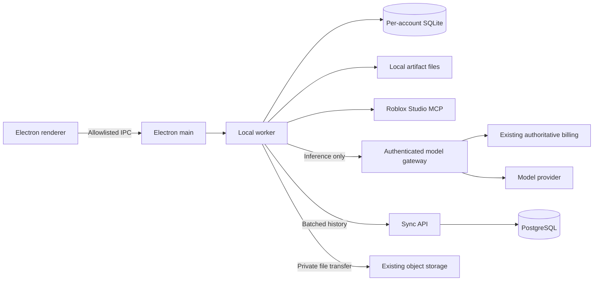

# Desktop workspace implementation and release gates

Implementation date: 10 September 2026. Status: **local preview; production cutover is not complete**.

The existing Electron companion is extended into a desktop workspace. The existing audited local MCP connector supplies Studio execution. Users do not need a separately installed Node runtime. The current package identity/version remains compatible with the connector; assign a new coordinated release version before publishing a public update.

## Implemented

| Area | Behaviour |
| --- | --- |
| Workspace | Ask, Plan, Agent, Debug, Quick Script and Studio Agent; conversation navigation; streaming answers; file attachments/downloads; history export; exact-plan approval; stop/resume; concrete Studio confirmation controls. |
| Shared website interface | Real website ribbon, project sidebar, model picker, rich chat, composer, resizable drawer, Files, Monaco editor/diffs, and report components are imported by the desktop Vite build. Billing, settings and support pages use desktop platform providers. Full workflow parity remains a release gate. |
| Desktop editor | Targeted Studio reads, source-hash and original-place checks, snapshot-protected writes, local push, native single-file/ZIP/Rojo export, saved creations and authenticated static readiness checks. Monaco and all five workers are bundled locally. |
| History navigation | Indexed keyset pagination for every entity kind, bounded renderer snapshots, older chat/message loading, project associations, atomic plan revisions, and paginated conflict comparison/resolution. Full list virtualization and complete pagination controls are still pending. |
| Local execution | A supervised Electron worker owns the agent loop and SQLite. The renderer has only an allowlisted IPC API. LocalStudio accepts no backend client, so it cannot enqueue or poll Firestore commands. |
| Studio | Metadata-only manifest first, targeted reads/search, script hash preconditions, script snapshots, audited instance operations, snapshot receipts, target/window attestation and verified mutation results. Model output cannot grant playtest consent. |
| Persistence | Per-account SQLite databases, WAL, atomic history/outbox transactions, schema version checks and a backup before upgrading schema 1. Active runs belonging to this device become interrupted after a restart. Other devices' runs keep their state. |
| Recovery | Exact model request bodies and IDs are saved before inference. Complete model results and tool receipts survive interruption. Resume never changes a call ID to retry the same paid request. Unknown Studio outcomes are blocked for inspection. |
| Sync | Automatic uploads after a 2-second pause, at most 10 seconds of continuous edits. At most 100 changes / about 900 KB per batch. Visible windows check for remote changes once a minute; failures back off to five minutes. Hidden windows stop scheduling periodic pulls. |
| Conflicts | Compare-and-swap revisions and durable operation IDs. Lost replies retry the original operation before uploading newer edits. Concurrent edits keep the cloud version and a separate local conflict copy. No last-write-wins overwrite of pending edits. |
| Files | Content-addressed local files; authenticated private blob endpoints; SHA-256 verification; 10 MiB per file; upload before synchronizing metadata; download on demand on another device. Text attachments enter bounded model context; binary files are stored/downloaded. |
| Gateway | Short-lived, audience-bound desktop sessions exchanged from the existing browser sign-in. Model selection, entitlements, reservations and charging remain server-owned. No provider keys or billing authority enter the app. |
| Billing recovery | PostgreSQL records unique inference calls and saves the provider receipt before settlement. Settlement can retry without another inference call. Explicit provider rejection releases reservations; uncertain usage stays flagged for reconciliation. |
| Cloud limits | Configurable 100 MiB history and 1 GiB file quotas per account. The change feed stores the latest revision per entity instead of an unlimited duplicate edit history. |
| Legacy migration | Explicit account-scoped dry-run/import for chats/messages, script versions, project snapshots, agent run history and workflow plan versions. Stable source IDs/checkpoints; changed sources or oversized records stop for reconciliation. Imported plans need new desktop approval; legacy runs cannot resume as local runs. |

Opening the workspace persists desktop mode. Future launches and sign-ins in that mode do not start the legacy cloud command poller. Existing users who have not selected desktop mode keep their current connector flow during transition.

## Architecture



SQLite saves are local. Auth/session exchange and the existing billing ledger still use Firebase. File storage still has storage/transfer costs. This change removes Firestore history, job progress and Studio command delivery from the desktop path; it does not make cloud inference or storage free.

## Run and package

From the repository root:

```powershell
npm ci
npm ci --prefix local-connector
npm ci --prefix desktop-connector
npm run check --prefix desktop-connector
npm run package:preview --prefix desktop-connector
```

The Windows preview installer is written under `desktop-connector/release-desktop-preview/`. It is never published by that command. The existing `package:mac` and signed connector release workflow supply the macOS packaging path and public update feed. A macOS build/sign/notarization must run on macOS.

For visual QA, `npm run preview:capture --prefix desktop-connector` renders the production UI with a clearly labelled simulated account. It rejects external HTTP requests, opens the real Monaco editor, starts the bundled editor/JSON/CSS/HTML/TypeScript workers, and visits billing/settings/support. It does not call cloud services or change Studio. Screenshots are written to `artifacts/desktop-workspace-preview.png` and `artifacts/desktop-shared-*.png`. These are desktop fixtures, not matched website-versus-desktop screenshot comparisons.

## Backend setup

`backend/` is an independent Git repository, ignored by the frontend repository. Ship/review both changes together.

1. Provision the selected PostgreSQL instance, configure private connectivity/TLS and backups, and set the variables in `backend/desktop.env.example`. Keep `DESKTOP_WORKSPACE_ENABLED=false` initially.
2. In `backend/`, install dependencies and run `npm run desktop:migrate`. This applies the explicit, repeatable SQL schema; request handlers do not run schema migrations.
3. Enable `DESKTOP_WORKSPACE_ENABLED=true` in staging, set `DESKTOP_ALLOWED_USER_IDS` to the explicit staging account UIDs, and start the backend using its existing configuration. An empty allowlist denies access; `*` is an explicit public rollout. The routes live under `/api/desktop/v1`.
4. Sign in through the app's existing browser flow, then open Desktop workspace. Point a development build at staging with `NEXUSRBX_API_URL`.
5. For a selected account, run `npm run desktop:import -- --uid=FIREBASE_UID --dry-run`, inspect counts and oversize/conflict errors, then run the same command with `--write`. The source is preserved. Pause legacy writes for the account before final migration reconciliation; the script does not enforce that ownership transition itself.
6. Run `npm run desktop:reconcile -- --dry-run` to inspect stale inference calls, then `--write` to settle saved receipts and flag stale calls without receipts. It never invokes inference. Schedule this backend maintenance command after staging acceptance. Missing provider receipts need actual usage investigation; the tool does not invent charges or refunds.

The public API must preserve streamed NDJSON responses and allow a model call up to four minutes. Desktop routes use their own authenticated session and are exempt from browser App Check. Session tokens last ten minutes. The server independently enforces entitlements on every inference request.

## Verification

The automated suites cover SQL account isolation, operation replay, revision conflicts, compact change cursors, one active inference claim, saved-receipt settlement, local restart recovery, lost upload replies, all six mode loops, read-only enforcement, playtest confirmation/cancellation, local-only streaming progress and verified file transfer between two simulated devices.

The implementation was also connected to the live Studio window `Place1`: discovery and a bounded metadata manifest passed, with `sourceIncluded=false`. This was a read-only check; it does not prove mutation/playtest parity.

The Windows installer was built locally. Its packaged executable passed startup checks for the renderer, preload, tray, OS secure storage, renderer isolation, sandbox, disabled Node integration, worker startup and a SQLite conversation round trip. The preview is unsigned. A simulated visual render also passed with no console errors. Both the desktop build and the existing website production build passed; the website sitemap refresh timed out and correctly retained its last-known-good files.

Repeatable commands:

```powershell
npm test --prefix local-connector
npm run check --prefix desktop-connector
node --test backend/src/lib/studioToolProtocol.test.js
node --test backend/src/services/desktop/*.test.js
```

No live paid inference, production PostgreSQL migration, historical user import or public release has been performed by this implementation.

### Shared UI preview verification, 10 September 2026

- Desktop: 42 Node tests and 7 renderer tests passed; type checking and production build passed.
- Local connector: 219 tests passed. Backend: 53 Studio protocol/desktop tests passed. Shared website billing/sidebar tests: 29 passed; editor/export tests: 4 passed.
- Website production build passed, including the public frontend. Its marketplace sitemap refresh failed and retained its last-known-good data.
- The rebuilt Windows executable passed all 9 packaged startup/SQLite-worker checks. The fixture also opened the shared UI from inside `app.asar`, exercised the actual Monaco editor and five bundled workers, and rendered billing/settings/support with no console errors or external HTTP requests.
- Installer: `desktop-connector/release-desktop-preview/NexusRBX-Desktop-Preview-0.3.6.exe`, 96,061,096 bytes. SHA-256: `532EFAFBD727114ABAC4F63C6E487F90DC6C52B80D6EF3C3540C1A1FFA301A7D`.
- This is an unsigned local preview retaining version 0.3.6, not a public update. Installing/upgrading on two platforms and signed automatic updates have not been validated.

See `desktop-feature-parity.md` for the complete remaining screen and operational checklist. Staging requires a selected Railway environment/PostgreSQL connection and explicit account allowlist; these are not configured locally.

## Remaining work before a public desktop requirement

This preview is not the entire product migration. These are explicit release blockers:

- Complete the canonical multi-step plan workflow, specialist generation adapters and asset/library/tool surfaces not exposed by the local connector. Selecting all six modes proves mode routing, not full feature equivalence with every current web flow. See `desktop-feature-parity.md` for the screen-level checklist.
- Verify the real gateway and entitlement combinations against staging: free/paid/team accounts, cancellation while inference is active, provider usage receipts, disconnect/reconnect and revoked sessions. Stopping locally halts further agent steps; an already accepted cloud inference finishes accounting.
- Exercise actual PostgreSQL over the network, two real devices, offline/restart, account switching, update/restart, large histories, quota exhaustion and backup restore. Finish project/artifact/version pagination controls and list virtualization before migrating accounts with very large histories. Conflict resolution now compares both records; retaining both project/conversation records does not duplicate their child history.
- Reconcile oversized/changed legacy documents, canonical workflow dependencies and project associations, then enforce per-account ownership so web and desktop cannot both continue writing legacy history after migration. Do not run a blanket destructive cleanup.
- Complete the applicable manual mutation, snapshot/undo, multi-window and playtest checks in `docs/studio-tool-protocol.md` using a disposable Studio place. Unsupported capabilities must remain explicit blockers.
- Build/sign Windows and macOS installers with a new coordinated release version, verify the updater on both platforms, and validate the current Electron/dependency support baseline before public release. Windows CI now requires signing credentials and a Valid Authenticode signature; local preview installers remain unsigned.
- Measure authenticated idle and representative runs in staging/production canaries. Confirm zero Firestore Studio-command/job-progress/history traffic from the desktop path and compare actual SKU charges. The service-level export alone cannot determine the final dollar savings.
- Only after the above gates pass, start the agreed 30-day transition, move web to accounts/downloads/billing/read-only history, and retire legacy workers/listeners/polling. Keep an operational rollback until migrated users and cost metrics are healthy.

The current feature flag and preserved legacy path are intentional: disabling the website or cloud workers now would remove capabilities before the desktop replacement is ready.
