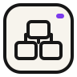
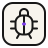
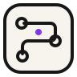
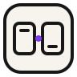
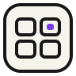
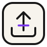
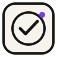

# Nexus display icon system

This board is the reference contract for NexusRBX’s flat 2D display icons. The family takes its rounded ink frame, off-white field, heavy line, and restrained purple seam signal from `nexus-mark.svg` without turning product actions into logo variants.

| Preview | Asset | Product meaning |
| --- | --- | --- |
|  | `ask.svg` | Start with a creator request or question. |
|  | `build.svg` | Construct a connected game system or experience. |
|  | `edit.svg` | Change an existing script, interface, or object. |
|  | `debug.svg` | Trace a failure and verify the correction. |
|  | `plan.svg` | Review the route before material changes. |
|  | `studio-connect.svg` | Pair Nexus with the selected Studio place. |
|  | `assets.svg` | Inspect or work with project assets and references. |
|  | `snapshot.svg` | Preserve a recoverable project state. |
|  | `publish.svg` | Move a reviewed result toward release. |
|  | `complete.svg` | Mark a reviewed request or verification as complete. |

## Visual contract

- Canvas: `96 × 96`, legible from 40 px upward.
- Construction: flat paths only; no gradients, filters, extrusion, perspective, text, sparkles, or wand metaphors.
- Ink: `currentColor`, four-pixel round line language, with a five-pixel check only where optical weight requires it.
- Field: warm off-white `#F7F4ED` inside the same 20 px rounded frame used across the set.
- Signal: exactly one restrained purple `#7C3AED` element per icon. It is a Nexus state cue, not decorative lighting.
- Use: explanatory workflow rows, empty states, onboarding, and other display-sized moments. Keep compact interactive controls on the existing semantic vector control set.
- Accessibility: use an empty alt when the adjacent label already names the action; provide concise alt text only when the image carries meaning on its own.

The identical mirror in `public-frontend/public/assets/nexus-display-icons/` is intentional: the statically exported public homepage and the authenticated React workspace have separate public roots.
