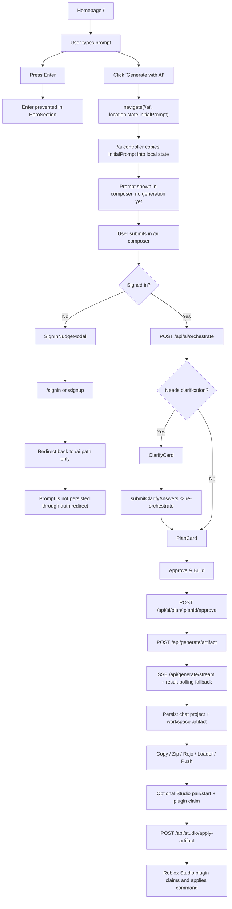
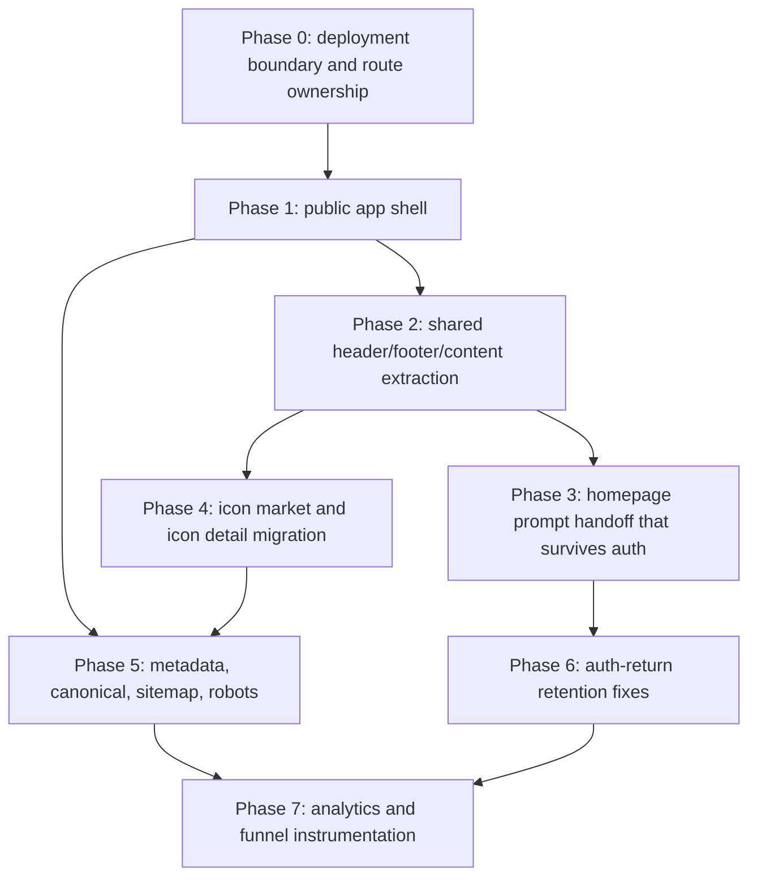

# SEO and Retention Implementation Map

Date: 2026-06-25

## Current architecture

### Frontend

- Framework: React 18 SPA bootstrapped with Create React App (`react-scripts`).
- Routing: `react-router-dom` `BrowserRouter` in [src/App.js](/Users/jackrow/nexusairbx/src/App.js).
- Entry point: [src/index.js](/Users/jackrow/nexusairbx/src/index.js).
- Route components are lazy-loaded in [src/App.js](/Users/jackrow/nexusairbx/src/App.js).
- SEO/meta handling is ad hoc with `react-helmet`; there is no server rendering, static prerender pipeline, or centralized metadata system.
- The `/ai` experience is a code-first authenticated workspace, not a marketing page and not the legacy visual UI builder.
- There is a second, older AI/UI-builder surface under `/api/ui-builder/*`; it is not the same stack as the `/ai` workspace.

### Backend

- Runtime: Node 22 + Express in [backend/server.js](/Users/jackrow/nexusairbx/backend/server.js).
- API is split across route modules under [backend/src/routes](/Users/jackrow/nexusairbx/backend/src/routes).
- Persistence: Firebase Admin + Firestore via [backend/src/lib/firebaseAdmin.js](/Users/jackrow/nexusairbx/backend/src/lib/firebaseAdmin.js).
- Long-running generation uses Firestore-backed jobs via [backend/src/services/JobService.js](/Users/jackrow/nexusairbx/backend/src/services/JobService.js) and worker execution in [backend/src/workers/generateArtifactWorker.js](/Users/jackrow/nexusairbx/backend/src/workers/generateArtifactWorker.js).
- Streaming is SSE over `/api/generate/stream`, with a short-lived cookie session minted by `/api/stream/session`.

### Authentication

- Frontend auth: Firebase Auth initialized in [src/firebase.js](/Users/jackrow/nexusairbx/src/firebase.js).
- Auth redirect helpers: [src/lib/firebaseAuth.js](/Users/jackrow/nexusairbx/src/lib/firebaseAuth.js).
- Global redirect completion handler: [src/components/AuthRedirectHandler.jsx](/Users/jackrow/nexusairbx/src/components/AuthRedirectHandler.jsx).
- Backend auth enforcement: Bearer Firebase ID token via [backend/src/middleware/auth.js](/Users/jackrow/nexusairbx/backend/src/middleware/auth.js).
- SSE auth is separate: frontend calls [src/lib/streamSession.js](/Users/jackrow/nexusairbx/src/lib/streamSession.js), backend issues an HttpOnly cookie in [backend/src/routes/streamSession.js](/Users/jackrow/nexusairbx/backend/src/routes/streamSession.js).

### Hosting and deployment

- Frontend production build is static CRA output served with `npx serve -s build` from [nixpacks.toml](/Users/jackrow/nexusairbx/nixpacks.toml).
- `serve -s build` is what currently rewrites unknown frontend URLs to `index.html`.
- There is no `vercel.json`, no Next.js app, and no SSR-capable frontend runtime in the repo today.
- Backend CORS explicitly allows `nexusrbx`, `nexusairbx`, localhost, and matching Vercel preview domains in [backend/src/config/cors.js](/Users/jackrow/nexusairbx/backend/src/config/cors.js).

## Relevant file map

| Concern | Primary files | Notes |
| --- | --- | --- |
| SPA boot and route ownership | [src/index.js](/Users/jackrow/nexusairbx/src/index.js), [src/App.js](/Users/jackrow/nexusairbx/src/App.js) | CRA + `BrowserRouter`, all public and app routes live in one SPA |
| Homepage | [src/pages/Homepage.jsx](/Users/jackrow/nexusairbx/src/pages/Homepage.jsx), [src/components/home/HeroSection.jsx](/Users/jackrow/nexusairbx/src/components/home/HeroSection.jsx) | Prompt input, homepage metadata, prompt handoff to `/ai` |
| `/ai` route shell | [src/pages/AiPage.jsx](/Users/jackrow/nexusairbx/src/pages/AiPage.jsx) | Thin wrapper around controller + layout |
| `/ai` controller | [src/pages/ai/useAiWorkspaceController.js](/Users/jackrow/nexusairbx/src/pages/ai/useAiWorkspaceController.js) | Restores homepage prompt, binds chat/workspace/studio/telemetry |
| `/ai` chat orchestration | [src/hooks/useUnifiedChat.js](/Users/jackrow/nexusairbx/src/hooks/useUnifiedChat.js) | Clarify vs plan vs ask, auth gate, approve plan |
| `/ai` generation execution | [src/hooks/useAiChat.js](/Users/jackrow/nexusairbx/src/hooks/useAiChat.js) | Creates jobs, opens SSE, persists pending/final assistant messages |
| Plan and clarify UI | [src/components/ai/chat/FlowCards.jsx](/Users/jackrow/nexusairbx/src/components/ai/chat/FlowCards.jsx) | Clarify form, plan approval CTA |
| Workspace layout | [src/pages/ai/AgentWorkspaceLayout.jsx](/Users/jackrow/nexusairbx/src/pages/ai/AgentWorkspaceLayout.jsx) | Mobile tabs, Studio manifest, workspace terminal |
| Artifact/file workspace | [src/hooks/useArtifactWorkspace.js](/Users/jackrow/nexusairbx/src/hooks/useArtifactWorkspace.js), [src/components/ai/workspace/CodeWorkspace.jsx](/Users/jackrow/nexusairbx/src/components/ai/workspace/CodeWorkspace.jsx) | Materialized project view, local edits, save/revert |
| Export/download/push actions | [src/components/ai/workspace/ExportActions.jsx](/Users/jackrow/nexusairbx/src/components/ai/workspace/ExportActions.jsx), [src/lib/studioBridgeApi.js](/Users/jackrow/nexusairbx/src/lib/studioBridgeApi.js), [src/lib/rojoExport.js](/Users/jackrow/nexusairbx/src/lib/rojoExport.js) | Copy, zip, Rojo export, Studio loader, Studio push |
| Auth pages | [src/pages/SignInPage.jsx](/Users/jackrow/nexusairbx/src/pages/SignInPage.jsx), [src/pages/SignUpPage.jsx](/Users/jackrow/nexusairbx/src/pages/SignUpPage.jsx), [src/components/SignInNudgeModal.jsx](/Users/jackrow/nexusairbx/src/components/SignInNudgeModal.jsx) | Sign-in redirects by pathname only |
| Backend workflow orchestration | [backend/src/routes/workflow.js](/Users/jackrow/nexusairbx/backend/src/routes/workflow.js) | `/api/ai/orchestrate`, plan creation, plan approval |
| Backend generation | [backend/src/routes/ai.js](/Users/jackrow/nexusairbx/backend/src/routes/ai.js), [backend/src/workers/generateArtifactWorker.js](/Users/jackrow/nexusairbx/backend/src/workers/generateArtifactWorker.js) | Job enqueue, stream, result polling, actual artifact generation |
| Agent runs and approval | [backend/src/services/AgentRunService.js](/Users/jackrow/nexusairbx/backend/src/services/AgentRunService.js), [backend/src/services/StudioAgentService.js](/Users/jackrow/nexusairbx/backend/src/services/StudioAgentService.js) | Unified tool-step state, destructive approval, restore |
| Studio bridge | [backend/src/routes/studio.js](/Users/jackrow/nexusairbx/backend/src/routes/studio.js), [backend/src/services/StudioBridgeService.js](/Users/jackrow/nexusairbx/backend/src/services/StudioBridgeService.js), [roblox-plugin/NexusRBXStudioBridge.plugin.lua](/Users/jackrow/nexusairbx/roblox-plugin/NexusRBXStudioBridge.plugin.lua) | Pairing, command queue, plugin polling, manifest, apply |
| Project persistence | [backend/src/services/ChatProjectService.js](/Users/jackrow/nexusairbx/backend/src/services/ChatProjectService.js), [backend/src/services/WorkspaceArtifactService.js](/Users/jackrow/nexusairbx/backend/src/services/WorkspaceArtifactService.js), [backend/src/routes/artifacts.js](/Users/jackrow/nexusairbx/backend/src/routes/artifacts.js) | Chat project snapshot + workspace artifact revisions |
| Script library persistence | [backend/src/services/ScriptService.js](/Users/jackrow/nexusairbx/backend/src/services/ScriptService.js), [backend/src/routes/scripts.js](/Users/jackrow/nexusairbx/backend/src/routes/scripts.js), [src/hooks/useAiScripts.js](/Users/jackrow/nexusairbx/src/hooks/useAiScripts.js) | Older saved-script system |
| Icon marketplace | [src/pages/IconsMarketPage.jsx](/Users/jackrow/nexusairbx/src/pages/IconsMarketPage.jsx), [src/pages/IconDetailPage.jsx](/Users/jackrow/nexusairbx/src/pages/IconDetailPage.jsx), [backend/src/routes/icons.js](/Users/jackrow/nexusairbx/backend/src/routes/icons.js), [backend/src/routes/collections.js](/Users/jackrow/nexusairbx/backend/src/routes/collections.js) | Firestore-backed icon listing/detail/export plus saved collections |
| Metadata and canonical | [src/pages/Homepage.jsx](/Users/jackrow/nexusairbx/src/pages/Homepage.jsx), [src/pages/IconDetailPage.jsx](/Users/jackrow/nexusairbx/src/pages/IconDetailPage.jsx), [public/index.html](/Users/jackrow/nexusairbx/public/index.html) | Manual, inconsistent Helmet usage |
| Sitemap | [scripts/generate-sitemap.js](/Users/jackrow/nexusairbx/scripts/generate-sitemap.js), [public/sitemap.xml](/Users/jackrow/nexusairbx/public/sitemap.xml), [public/robots.txt](/Users/jackrow/nexusairbx/public/robots.txt) | Script fetches icon IDs from backend and writes static XML |
| Analytics and telemetry | [src/firebase.js](/Users/jackrow/nexusairbx/src/firebase.js), [src/lib/aiTelemetry.js](/Users/jackrow/nexusairbx/src/lib/aiTelemetry.js), [src/lib/deferredClientLog.js](/Users/jackrow/nexusairbx/src/lib/deferredClientLog.js), [backend/server.js](/Users/jackrow/nexusairbx/backend/server.js), [backend/src/routes/uiBuilder.js](/Users/jackrow/nexusairbx/backend/src/routes/uiBuilder.js) | Firebase analytics lazy init, AI telemetry ingest, backend page-view counter, client log sink |
| Mobile-specific behavior | [src/pages/ai/useAiWorkspaceController.js](/Users/jackrow/nexusairbx/src/pages/ai/useAiWorkspaceController.js), [src/pages/ai/AgentWorkspaceLayout.jsx](/Users/jackrow/nexusairbx/src/pages/ai/AgentWorkspaceLayout.jsx), [src/components/NexusRBXHeader.jsx](/Users/jackrow/nexusairbx/src/components/NexusRBXHeader.jsx) | Responsive header and mobile tabbed `/ai` workspace |

## Exact file and function ownership

### Blocking Enter on the homepage

- File: [src/components/home/HeroSection.jsx](/Users/jackrow/nexusairbx/src/components/home/HeroSection.jsx)
- Exact code path: homepage `<input>` `onKeyDown`
- Current behavior: if `e.key === "Enter" && !e.shiftKey`, it calls `e.preventDefault()`
- Important mismatch: the UI copy says “press Enter”, but Enter is currently blocked and only the button submits

### Passing the prompt to `/ai`

- File: [src/pages/Homepage.jsx](/Users/jackrow/nexusairbx/src/pages/Homepage.jsx)
- Function: `handleSubmit`
- Mechanism: `navigate("/ai", { state: { initialPrompt: inputValue.trim(), aiResult: null } })`

### Restoring the prompt inside `/ai`

- File: [src/pages/ai/useAiWorkspaceController.js](/Users/jackrow/nexusairbx/src/pages/ai/useAiWorkspaceController.js)
- Behavior: reads `location.state.initialPrompt`, copies it into local `prompt` state, then immediately clears router state with `navigate(..., { replace: true })`
- Important limitation: this restores the prompt only on the first `/ai` navigation inside the same SPA session

### Preventing anonymous generation

- Primary frontend gate: [src/hooks/useUnifiedChat.js](/Users/jackrow/nexusairbx/src/hooks/useUnifiedChat.js) `handleSubmit`
- Secondary frontend guard: [src/hooks/useAiChat.js](/Users/jackrow/nexusairbx/src/hooks/useAiChat.js) `handleSubmit`
- UX path for interruption: [src/components/SignInNudgeModal.jsx](/Users/jackrow/nexusairbx/src/components/SignInNudgeModal.jsx)
- Backend hard gate: `verifyFirebaseToken` in [backend/src/middleware/auth.js](/Users/jackrow/nexusairbx/backend/src/middleware/auth.js), mounted on `/api/ai/orchestrate`, `/api/generate/artifact`, `/api/ai/chat`, `/api/ai/improve-prompt`, and Studio/app routes

### Creating plans

- Frontend initiator: [src/hooks/useUnifiedChat.js](/Users/jackrow/nexusairbx/src/hooks/useUnifiedChat.js) `handleSubmit`
- API client: [src/lib/workflowApi.js](/Users/jackrow/nexusairbx/src/lib/workflowApi.js) `orchestrate`
- Backend route: [backend/src/routes/workflow.js](/Users/jackrow/nexusairbx/backend/src/routes/workflow.js) `router.post("/ai/orchestrate", ...)`
- Persisted records: `users/{uid}/workflow_plans/{planId}`

### Requiring approval

- Plan approval UI: [src/components/ai/chat/FlowCards.jsx](/Users/jackrow/nexusairbx/src/components/ai/chat/FlowCards.jsx) `PlanCard`
- Client approval call: [src/hooks/useUnifiedChat.js](/Users/jackrow/nexusairbx/src/hooks/useUnifiedChat.js) `approvePlanInternal`
- Approval API: [src/lib/workflowApi.js](/Users/jackrow/nexusairbx/src/lib/workflowApi.js) `approveWorkflowPlan`
- Backend route: [backend/src/routes/workflow.js](/Users/jackrow/nexusairbx/backend/src/routes/workflow.js) `router.post("/ai/plan/:planId/approve", ...)`
- Separate Studio destructive-step approval: [backend/src/services/AgentRunService.js](/Users/jackrow/nexusairbx/backend/src/services/AgentRunService.js) `queueStudioStep` and `approveStep`, exposed through [backend/src/routes/workflow.js](/Users/jackrow/nexusairbx/backend/src/routes/workflow.js) `POST /ai/agent/:runId/approve-step`

### Generating scripts and projects

- Frontend job creation: [src/hooks/useAiChat.js](/Users/jackrow/nexusairbx/src/hooks/useAiChat.js) `handleSubmit`
- Backend queue route: [backend/src/routes/ai.js](/Users/jackrow/nexusairbx/backend/src/routes/ai.js) `router.post("/generate/artifact", ...)`
- Worker implementation: [backend/src/workers/generateArtifactWorker.js](/Users/jackrow/nexusairbx/backend/src/workers/generateArtifactWorker.js)
- Streaming route: [backend/src/routes/ai.js](/Users/jackrow/nexusairbx/backend/src/routes/ai.js) `router.get("/generate/stream", ...)`

### Sending analytics

- Lazy Firebase analytics init: [src/firebase.js](/Users/jackrow/nexusairbx/src/firebase.js) `initAnalytics`
- AI/auth telemetry batching: [src/lib/aiTelemetry.js](/Users/jackrow/nexusairbx/src/lib/aiTelemetry.js)
- Telemetry call sites: [src/pages/ai/useAiWorkspaceController.js](/Users/jackrow/nexusairbx/src/pages/ai/useAiWorkspaceController.js), [src/pages/SignInPage.jsx](/Users/jackrow/nexusairbx/src/pages/SignInPage.jsx), [src/pages/SignUpPage.jsx](/Users/jackrow/nexusairbx/src/pages/SignUpPage.jsx)
- Backend AI telemetry ingest: [backend/src/routes/uiBuilder.js](/Users/jackrow/nexusairbx/backend/src/routes/uiBuilder.js) `POST /api/ui-builder/ai/telemetry`
- Deferred client log sink: [src/lib/deferredClientLog.js](/Users/jackrow/nexusairbx/src/lib/deferredClientLog.js) -> [backend/server.js](/Users/jackrow/nexusairbx/backend/server.js) `POST /api/client-log`
- Backend page-view counter: [backend/server.js](/Users/jackrow/nexusairbx/backend/server.js) global middleware writing `_meta/stats`
- Important finding: `@vercel/analytics` is installed in `package.json` but is not imported anywhere in app code

### Generating sitemap URLs

- Script: [scripts/generate-sitemap.js](/Users/jackrow/nexusairbx/scripts/generate-sitemap.js)
- Static routes are hardcoded in `staticRoutes`
- Icon detail URLs are derived from backend `GET /api/icons/market?limit=1000`
- Output path: [public/sitemap.xml](/Users/jackrow/nexusairbx/public/sitemap.xml)

### Setting canonical URLs

- Current canonical implementation exists only on the homepage in [src/pages/Homepage.jsx](/Users/jackrow/nexusairbx/src/pages/Homepage.jsx)
- `IconDetailPage` sets title/description/OpenGraph but does not set a canonical
- There is no centralized canonical helper or sitewide metadata contract

### Rewriting unknown URLs to `index.html`

- Production: [nixpacks.toml](/Users/jackrow/nexusairbx/nixpacks.toml) starts `npx serve -s build -l $PORT`
- The `-s` flag is the current SPA fallback mechanism for unknown routes
- There is no repo-local CDN/proxy rewrite config for a mixed SSR + SPA deployment

### Rendering individual icon pages

- Route registration: [src/App.js](/Users/jackrow/nexusairbx/src/App.js) `/icons/:id`
- Page component: [src/pages/IconDetailPage.jsx](/Users/jackrow/nexusairbx/src/pages/IconDetailPage.jsx)
- Data source: [backend/src/routes/icons.js](/Users/jackrow/nexusairbx/backend/src/routes/icons.js) `GET /api/icons/:id`

## Current user-flow diagram

### Current journey detail

1. Homepage visit
- `BrowserRouter` serves `/` into `Homepage`.
- Helmet metadata is injected client-side only.

2. Prompt entry
- The hero input is plain text in `Homepage`.
- Enter is blocked in `HeroSection`, so the CTA button is the only working submit path.

3. Homepage submission
- `Homepage.handleSubmit` navigates to `/ai` and places the prompt into `location.state.initialPrompt`.
- No backend call happens on the homepage.

4. Navigation to `/ai`
- `useAiWorkspaceController` reads `location.state.initialPrompt` and places it into `/ai` local state.
- It then strips that state from history.

5. Authentication interruption
- Anonymous users can view `/ai`, but `useUnifiedChat.handleSubmit` refuses to orchestrate and opens `SignInNudgeModal`.
- Sign-in pages redirect back to `/ai` by pathname.

6. Prompt restoration
- Current restoration only works on the initial SPA handoff from homepage to `/ai`.
- There is no sessionStorage, query-string, Firestore draft, or auth-return state that preserves the prompt through sign-in.
- Result: a homepage prompt is lost if auth interrupts before `/ai` submission.

7. Clarification
- `/api/ai/orchestrate` returns either `conversation`, `needs_clarification`, or `awaiting_approval`.
- Clarification UI is rendered by `ClarifyCard`, then `submitClarifyAnswers` re-calls orchestration.

8. Planning
- A plan is stored under `users/{uid}/workflow_plans/{planId}`.
- The plan card renders markdown plus machine steps.

9. Approval
- User must explicitly approve via button or matching approval text.
- Approval flips the workflow plan to `approved`.

10. Generation
- `useAiChat.handleSubmit` creates a Firestore-backed job through `/api/generate/artifact`.
- It then opens SSE, tracks stage/delta/tool-step events, and falls back to polling `/api/generate/result`.

11. Copy/download
- Export UI supports copy current file, copy all files, single file download, placement zip, Rojo zip, Studio loader snippet, and readiness verification.

12. Studio connection and push
- Pairing starts via `/api/studio/pair/start`.
- The Roblox plugin claims the pair code via `/api/studio/pair/claim`.
- Pushing a generated artifact uses `/api/studio/apply-artifact`, which computes managed Studio operations and queues a Studio tool command.

## Current architecture gaps relevant to SEO and retention

- Public HTML is not server-rendered or prerendered.
- Metadata is inconsistent and client-only.
- Only the homepage has a canonical tag.
- `icons-market` is not actually public in practice because it redirects anonymous users to `/signin`.
- Homepage prompt handoff depends on React Router `location.state`, which will not survive a cross-app migration or auth redirect.
- Prompt restoration is local-only and fragile.
- `@vercel/analytics` is unused.
- Current page-view counting is backend middleware, not route-aware marketing analytics.

## Proposed target architecture

Recommendation: add a Next.js app for public routes and migrate those routes incrementally, while keeping the existing CRA app intact for the authenticated workspace in phase 1.

### Why this is the best fit for the repo as it exists

- The existing `/ai` workspace is deeply stateful and coupled to:
  - `BrowserRouter` location state
  - Firebase Auth client state
  - live Firestore subscriptions
  - SSE cookie sessions
  - Studio plugin polling and workspace terminal streams
- The public SEO surface is comparatively small and separable:
  - `/`
  - `/docs`
  - `/contact`
  - `/privacy`
  - `/terms`
  - `/icons-market`
  - `/icons/:id`
- There is no SSR/static-rendering solution already implemented in this repo beyond CRA static serving and a manually generated sitemap.
- A full frontend conversion before the SEO/retention project would force simultaneous migration of:
  - Firebase auth flows
  - `/ai` streaming and workspace state
  - Firestore subscriptions
  - Studio bridge UX
  - export/push flows
  - all route ownership at once

### Recommended shape

- New Next.js app owns public SEO routes.
- Existing CRA app continues to own `/ai` and authenticated utility routes in the first migration stage.
- Backend Express API remains unchanged initially.
- Homepage prompt handoff must move from `location.state` to a transport that survives cross-app navigation:
  - preferred: query string + sessionStorage draft fallback
  - optional later: anonymous draft document or signed short-lived draft token

### Explicit recommendation among the options

- Add Next.js alongside the existing frontend: yes
- Incrementally migrate public routes: yes
- Convert the existing frontend immediately: no
- Use another SSR/static solution already supported by the repository: no; none exists beyond static CRA serving

## Route ownership table

| Route | Current owner | Current behavior | Recommended owner |
| --- | --- | --- | --- |
| `/` | CRA SPA | Client-rendered homepage with prompt handoff to `/ai` | Next.js public app |
| `/docs` | CRA SPA | Client-rendered docs page | Next.js public app |
| `/contact` | CRA SPA | Client-rendered static page | Next.js public app |
| `/privacy` | CRA SPA | Client-rendered static page | Next.js public app |
| `/terms` | CRA SPA | Client-rendered static page | Next.js public app |
| `/icons-market` | CRA SPA | Client-rendered marketplace, redirects anonymous users to sign-in | Next.js public app after removing auth redirect requirement |
| `/icons/:id` | CRA SPA | Client-rendered detail page with partial metadata | Next.js public app |
| `/tools/icon-generator` | CRA SPA | Client-rendered tool page | Keep in CRA initially unless it becomes public acquisition surface |
| `/ai` | CRA SPA | Authenticated code-first agent workspace | Keep in CRA initially |
| `/signin` | CRA SPA | Firebase auth screen with return-path handling | Keep in CRA initially |
| `/signup` | CRA SPA | Firebase auth screen with return-path handling | Keep in CRA initially |
| `/settings` | CRA SPA | Authenticated account/settings page | Keep in CRA initially |
| `/billing` | CRA SPA | Authenticated billing page | Keep in CRA initially |
| `/subscribe` | CRA SPA | Subscription page | Could move later; keep in CRA first |
| `/debug/*` | CRA SPA | Internal/admin | Keep in CRA |
| `/api/*` | Express backend | Existing API surface | No change in phase 1 |

## Analytics architecture

### What exists now

| System | Files | What it does | Gaps |
| --- | --- | --- | --- |
| Firebase Analytics | [src/firebase.js](/Users/jackrow/nexusairbx/src/firebase.js) | Lazy-loads `firebase/analytics` in production | No route-level implementation was found beyond init |
| AI telemetry batching | [src/lib/aiTelemetry.js](/Users/jackrow/nexusairbx/src/lib/aiTelemetry.js), [backend/src/routes/uiBuilder.js](/Users/jackrow/nexusairbx/backend/src/routes/uiBuilder.js) | Sends authenticated event batches to Firestore `aiTelemetryEvents` | Only fires after sign-in because it needs a token |
| Auth page telemetry | [src/pages/SignInPage.jsx](/Users/jackrow/nexusairbx/src/pages/SignInPage.jsx), [src/pages/SignUpPage.jsx](/Users/jackrow/nexusairbx/src/pages/SignUpPage.jsx) | Tracks sign-in/sign-up page view and submit/success events | No anonymous homepage funnel telemetry was found through this path |
| AI page telemetry | [src/pages/ai/useAiWorkspaceController.js](/Users/jackrow/nexusairbx/src/pages/ai/useAiWorkspaceController.js) | Tracks `/ai` page view, prompt submission, artifact generation, actions | Authenticated only |
| Deferred client logs | [src/lib/deferredClientLog.js](/Users/jackrow/nexusairbx/src/lib/deferredClientLog.js), [backend/server.js](/Users/jackrow/nexusairbx/backend/server.js) | Best-effort browser error/client issue log sink | Operational log, not product analytics |
| Page-view counter | [backend/server.js](/Users/jackrow/nexusairbx/backend/server.js) | Increments `_meta/stats.pageViews` for `/` and `/api/*` hits | Too coarse for SEO/retention funnel measurement |
| Vercel analytics package | `package.json` | Dependency only | Not wired into app |

### Recommendation

- Keep backend AI telemetry for authenticated `/ai` funnel events.
- Add a public-route analytics layer in the new public app for:
  - homepage visit
  - homepage prompt intent
  - click-through to `/ai`
  - auth interruption
  - auth completion
  - prompt restoration success/failure
- Do not expose anonymous generation in order to “improve retention”; keep acquisition and generation analytics separate from generation entitlement checks.

## Phase dependency map

## Migration risks

### Authentication compatibility

- Current sign-in return logic preserves pathname, not prompt draft state.
- Current homepage prompt transport is `location.state`, which will break across app boundaries.
- OAuth redirect helpers store only return path and method in session storage, not prompt content.
- Risk: public-route migration without a new handoff mechanism will worsen the existing prompt-loss problem.

### Shared component duplication

- Header/footer and marketing sections live inside the CRA app.
- Rebuilding public routes in Next without extraction will duplicate Tailwind markup and content.
- Risk: design divergence and double maintenance.

### API compatibility

- `/ai` relies on bearer-token auth, Firestore subscriptions, and SSE cookie sessions.
- Introducing another frontend runtime is safe only if backend API URLs, auth origin, and cookie paths stay stable.
- Risk: cross-origin or path-based deployment changes break streaming or auth silently.

### Deployment routing conflicts

- Current production frontend is a single static bundle served with SPA fallback.
- The repo does not contain a mixed Next + CRA edge/proxy config.
- Risk: route ownership cutover cannot be completed from application code alone.

### SEO regression risk

- Current public HTML is largely client-rendered.
- `icons-market` currently redirects anonymous traffic to sign-in, which is hostile to indexing.
- Metadata is inconsistent and canonicals are mostly missing.
- Risk: migrating only some routes without fixing canonical and crawlability may create duplicate or thin-index pages.

### Anonymous AI abuse and cost risk

- Backend generation endpoints are fully authenticated today.
- Any “retention” work that turns homepage prompt entry into immediate anonymous generation would bypass the current economic guardrail.
- Risk: cost exposure and abuse unless generation stays behind sign-in or a separate abuse-resistant quota system.

### Existing user/project migration risk

- Current persistence is already in Firestore and not coupled to route names:
  - `users/{uid}/chats/*`
  - `users/{uid}/chats/{chatId}/project/current`
  - `users/{uid}/workspace_artifacts/*`
  - `users/{uid}/scripts/*`
- The risk is not data format migration first; it is UX continuity:
  - homepage prompt handoff
  - auth return
  - icon market public/private behavior
  - route ownership during cutover

## Recommended implementation order

1. Establish deployment/routing ownership first.
- Decide how public Next routes and legacy CRA routes are split on the same domain before product work starts.

2. Replace homepage prompt handoff with a cross-app-safe draft transport.
- This is a prerequisite for any public-route migration because `location.state` will not survive it.

3. Migrate the homepage and static marketing routes.
- These have the highest SEO value and lowest coupling to `/ai`.

4. Make icon discovery and icon detail pages truly crawlable.
- `icons-market` must stop forcing anonymous users into `/signin`.

5. Add centralized metadata/canonical/sitemap generation in the public app.
- Remove the current manual, route-by-route Helmet drift.

6. Add analytics for the public-to-authenticated funnel.
- Measure homepage prompt intent, auth interruption, auth completion, and restored-prompt conversion.

7. Defer `/ai` migration.
- Keep the authenticated workspace in CRA until the SEO/retention scope is complete and stable.

## Test strategy

### Existing automated coverage

- Frontend: Jest tests across utilities, components, pricing/billing, streaming, artifact state, asset panels, and auth helpers.
- Backend: Node test coverage across billing, free usage, intent classification, stream recovery, Studio protocol, Studio manifest, Studio agent runs, Roblox OAuth, project assets, workspace runner, and more.
- CI: [`.github/workflows/frontend-ci.yml`](/Users/jackrow/nexusairbx/.github/workflows/frontend-ci.yml) runs frontend tests and build only.

### Gaps for this project

- No SSR/public-route integration tests exist because there is no SSR stack yet.
- No tests currently validate:
  - canonical tags across all public routes
  - sitemap output against live route inventory
  - homepage prompt surviving auth interruption
  - anonymous crawler access to icon market/detail pages

### Recommended test additions

1. Public route rendering tests.
- Validate title, description, canonical, structured data, and 200 HTML per route.

2. Sitemap tests.
- Assert generated sitemap includes static routes and icon detail routes.

3. Prompt handoff/auth-return E2E tests.
- Homepage prompt -> `/ai` -> sign-in -> return -> prompt restored.

4. Guardrail tests.
- Anonymous users can browse public content but cannot hit generation endpoints.

5. Deployment smoke tests.
- Verify route splits do not break `/ai`, `/signin`, `/signup`, or `/api/*`.

## Rollback strategy

### Principle

- Keep the legacy CRA app and backend APIs unchanged while public routes are introduced incrementally.
- Roll back by switching route ownership, not by rewriting data.

### Practical rollback plan

1. Preserve the existing CRA build path intact.
- `/ai`, auth, settings, billing, scripts, and Studio tooling should remain untouched during initial public-route rollout.

2. Cut over public routes behind explicit route ownership.
- If the public app fails, send those routes back to the legacy SPA temporarily.

3. Do not change Firestore schemas in phase 1.
- Public-route migration should not require user or project data migration.

4. Keep sitemap generation dual-tracked during rollout.
- Validate new sitemap output before removing the current static sitemap script.

5. Add a prompt handoff fallback.
- If the new public app fails to hand off a prompt, `/ai` should still accept a direct query/draft fallback without data loss.

## Architectural recommendation

Use a parallel Next.js public app and migrate public routes incrementally. Do not convert the full CRA app before the SEO/retention project. The repo does not already support SSR, and the `/ai` workspace is too coupled to live auth, Firestore, SSE, Studio pairing, and local route state to make a whole-app conversion the right first move.

## Important findings

- The repo is not Next.js today. It is a CRA SPA with `BrowserRouter`.
- Homepage Enter submission is currently broken by design; the button works, Enter does not.
- Homepage prompt handoff to `/ai` uses React Router `location.state`, not URL or persisted draft state.
- Auth interruption currently loses that homepage prompt because sign-in returns to `/ai` by pathname only.
- Public SEO support is thin: manual Helmet on a few pages, only homepage canonical, static sitemap script, no SSR/prerender.
- `icons-market` is not actually public because it redirects anonymous visitors to sign-in.
- Backend generation is fully authenticated and job-based, which is good for abuse prevention.
- `@vercel/analytics` is installed but not wired in.
- The repo contains no existing Next.js package, config, or migration scaffold.

## Blockers

- Exact production route-splitting infrastructure is not in the repo.
- There is no repo-local config showing how the main domain currently fronts the static CRA app and backend together beyond `nixpacks.toml` for static serving and backend CORS allowances.
- That means the application-level implementation can be mapped confidently, but the final production cutover plan still needs hosting/proxy details from the deployment environment.

## Later prompt adjustments based on the real repository

Yes. Later implementation prompts should be adjusted to match the actual codebase:

- Say “CRA React SPA with `react-router-dom`”, not “Next.js app”.
- Treat `/ai` as the authenticated code-first workspace and `/api/ui-builder/*` as a separate legacy AI/UI-builder system.
- Account for the fact that homepage prompt handoff currently uses `location.state`.
- Account for the fact that sign-in/sign-up return to `/ai` by pathname only.
- Account for the fact that `icons-market` is currently auth-gated in the frontend despite being a public-looking route.
- Avoid proposing anonymous generation unless the prompt explicitly asks to redesign abuse/cost controls.
