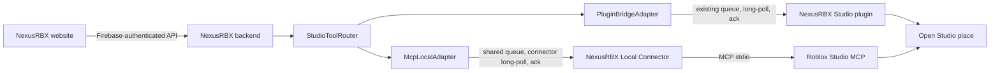

# Studio Connection Architecture

NexusRBX supports two independent connections to Roblox Studio:

- `plugin_bridge` is the recommended default. The NexusRBX Studio plugin owns the
  existing pairing, polling, approval, snapshot, artifact, native-model, trusted
  asset insertion, and validation behavior.
- `mcp_local` is an advanced connection. A user-run NexusRBX Local Connector
  authenticates to the NexusRBX backend and launches Roblox Studio's local MCP
  server over `stdio`. The browser never connects to the local MCP process.

The modes may be connected at the same time. Neither mode depends on the other.
Historical Studio sessions without a `connectionType` are treated as
`plugin_bridge`.

## Ownership and data flow

The backend remains authoritative for authentication, session ownership,
connection selection, approval state, command classification, command IDs,
idempotency metadata, queue state, acknowledgment state, and downstream result
processing. The connector is an executor, not an approval authority.

The connector discovers Studio MCP tools at runtime and registers only mappings
whose tool names and input schemas are understood. A connected process is not
the same as an available Studio MCP server, and the website reports those states
separately.

## Deterministic routing

`StudioToolRouter` follows these rules:

1. A supplied `sessionId` selects only that owned session. A missing, foreign,
   disconnected, or unavailable session is an error; it is never replaced.
2. A supplied `connectionType` without a `sessionId` selects a live owned session
   of that exact type.
3. With neither value, a live plugin session is preferred for backward
   compatibility. A live MCP session may be selected only when no live plugin
   session is available.
4. A command is checked against the selected adapter and the session's current
   advertised capabilities before it is queued.
5. A mutation is never silently moved between transports. A caller that wants a
   different transport must select it explicitly.

Unsupported MCP execution returns a structured `MCP_TOOL_UNAVAILABLE` error and,
where useful, tells the user that the plugin bridge provides the stronger
workflow.

## Shared command lifecycle

Both adapters use the existing Studio command collection and command states:

1. The website, agent, or backend workflow selects a session and queues a
   protocol-valid command.
2. The selected Studio client long-polls only the commands belonging to its own
   session.
3. Claiming records the delivery state without changing approval or command
   classification.
4. The plugin or local connector executes the command and returns a structured
   acknowledgment.
5. The backend completes the same post-ack pipeline for either transport. This
   includes agent-run progress, manifest persistence and pagination, validation
   state, trusted receipts, artifact state, and analytics where applicable.

Transport authentication never determines command success. A command is
successful only when the executor returns a successful result and any required
post-mutation verification passes.

## Capability boundary

The MCP adapter uses runtime discovery as its source of truth. The currently
documented Roblox tools include `script_read`, `multi_edit`, `script_search`,
`script_grep`, `search_game_tree`, `inspect_instance`, `get_studio_state`,
`get_console_output`, `start_stop_play`, `list_roblox_studios`, and
`set_active_studio`, among other broader tools. Names are case-sensitive and the
connector validates the discovered JSON Schema before registering a mapping.

`execute_luau` is never exposed as a generic command and browser requests never
contain executable source. It is used only by versioned connector-owned
routines whose Luau is constant, whose inputs are strictly serialized and
bounded, and whose nonce-bearing result envelope is validated before success.

The plugin remains the authoritative implementation for workflows that are not
part of direct MCP parity, including:

- `apply_artifact`
- `build_native_model`
- `inspect_native_model`
- `apply_native_model_patch`
- `insert_uploaded_roblox_model`
Direct official tools back script I/O, asset loading, play-mode transitions,
Studio enumeration, Studio activation, and Studio state reads. Fixed audited
connector routines back selection, instance edits, snapshots, restore/undo,
quarantine inspection, and named TestService profiles. A capability is exposed
only when every required direct tool or fixed-routine dependency compiles and a
session self-check succeeds. Mere tool presence is not sufficient.

## Team Create and multiple Studio windows

Session identity remains transport-specific. The backend deduplicates same-user,
same-place activity when reporting collaborators so a user's plugin and MCP
connector do not appear as another collaborator.

The connector enumerates sanitized live Studio targets. Exactly one target is
selected automatically. With multiple targets, the website requires the user to
choose an enumerated `studioId`; the connector confirms the switch before the
session becomes mutation-ready. The active target is rechecked before every
mutation and playtest. Closed, missing, or mismatched targets fail closed and are
never replaced by a guess.

## Public API summary

Website-authenticated routes:

| Method | Route | Purpose |
| --- | --- | --- |
| `POST` | `/api/studio/mcp/pair/start` | Create a short-lived connector pairing code |
| `GET` | `/api/studio/mcp/status` | Read the user's MCP connection state |
| `POST` | `/api/studio/mcp/disconnect` | Revoke an MCP session |
| `POST` | `/api/studio/mcp/test` | Test connector and Studio MCP availability |
| `POST` | `/api/studio/mcp/session/target` | Select one enumerated live Studio target |
| `GET` | `/api/studio/status` | Read the unified plugin and MCP session list |

Connector-authenticated routes:

| Method | Route | Purpose |
| --- | --- | --- |
| `POST` | `/api/studio/mcp/pair/claim` | Exchange a one-time code for a connector session |
| `POST` | `/api/studio/mcp/session/ping` | Refresh connector/MCP health and liveness |
| `POST` | `/api/studio/mcp/capabilities` | Register discovered, validated capabilities |
| `GET` | `/api/studio/mcp/commands/next` | Long-poll the selected session's queue |
| `POST` | `/api/studio/mcp/commands/:id/ack` | Acknowledge execution through the shared pipeline |

Legacy plugin routes and response shapes remain available.

Capability responses retain the ten compatibility booleans, but those values
are derived from complete `supportedCommands` groups. `capabilityDetails`
provides each group's status, reason code, required commands/tools, and last
verification time. Session metadata includes sanitized targets,
`activeStudioId`, place identity, and connector/protocol versions. Older
connectors and protocol versions fail closed.

## Operational events

MCP operations emit the following bounded, secret-free event names:

- `mcp_pair_created`
- `mcp_pair_claimed`
- `mcp_connector_connected`
- `mcp_connector_disconnected`
- `mcp_server_detected`
- `mcp_server_unavailable`
- `mcp_capabilities_updated`
- `mcp_command_claimed`
- `mcp_command_succeeded`
- `mcp_command_failed`
- `mcp_tool_unavailable`
- `mcp_source_conflict`
- `mcp_apply_unverified`

See [Studio MCP local connector](./studio-mcp-local-connector.md) for setup and
[Studio MCP security](./studio-mcp-security.md) for the trust model.

## Primary references

- [Roblox Studio MCP](https://create.roblox.com/docs/studio/mcp)
- [MCP lifecycle](https://modelcontextprotocol.io/specification/2025-11-25/basic/lifecycle)
- [MCP transports](https://modelcontextprotocol.io/specification/2025-11-25/basic/transports)
- [MCP tools](https://modelcontextprotocol.io/specification/2025-11-25/server/tools)
- [Official TypeScript client documentation](https://ts.sdk.modelcontextprotocol.io/client)
