# NexusRBX UI/UX Redesign Plan

Research, brutal audit, art direction, implementation record, and remaining roadmap
Prepared: 12 August 2026
Implementation update: 12 August 2026
Status: redesign implementation and required build, test, and Chromium browser verification are complete; publish/live-ops features and manual multi-browser assistive-technology QA remain roadmap work

## 1. Executive decision

NexusRBX should stop presenting itself as a moody AI script generator and become the **creator workshop for taking a Roblox game from idea to a playable, Studio-verified experience**.

The recommended direction is:

- Keep the current product skeleton: projects and chats on the left, mode controls at the top, an active build canvas in the middle, the composer at the bottom, and project tools on the right.
- Polish the layout rather than replacing the information architecture wholesale.
- Replace teal/blue and the editorial-finance feeling with a **purple 2D cartoon workshop**: electric violet, warm paper, deep plum, black ink outlines, sticker shadows, halftone texture, and restrained acid-lime/coral accents.
- Make the first promise “make the Roblox game in your head,” then prove breadth with multiple game genres and a visible plan → build → playtest loop. Treat publish readiness and growth tooling as explicit next phases.
- Treat Robux as creator upside, not guaranteed income. Show the systems that can produce upside—passes, developer products, subscriptions, retention, conversion, and iteration.
- Differentiate from Roblox Assistant by owning the full project lifecycle, not by claiming to be another script-writing chatbot.

The clearest positioning line is:

> **Make the Roblox game in your head.**
>
> Plan it, build it in Studio, playtest every change, and add Roblox-native monetization when the experience is ready.

The clearest supporting brand line is:

> **Build it. Ship it. Grow it.**

## 2. Brutal audit of the current product

### Scorecard

| Area | Current score | Honest diagnosis |
| --- | ---: | --- |
| Product positioning | 3/10 | “AI Roblox Script Generator” dramatically undersells the product and is being commoditized by Roblox itself. |
| Visual fit | 3/10 | The dark cinematic imagery, serif typography, and teal accents feel like an editorial or finance product, not a playful creator workshop. |
| Uniqueness | 4/10 | It is polished in places, but the hero follows a familiar dark-AI-SaaS template and has no ownable visual device. |
| First-screen clarity | 6/10 | The prompt is understandable, but the prompt, main CTA, connector CTA, and cinematic art compete for attention. |
| Proof of “any game” | 2/10 | The page says what the tool does but does not demonstrate genre range, real builds, or an end-to-end outcome. |
| Robux/growth story | 2/10 | There is no convincing bridge from creating a game to retaining players, adding monetization, and learning from results. |
| Workspace structure | 7/10 | The sidebar, canvas, composer, and tool rail are fundamentally useful and should be retained. |
| Workspace hierarchy | 4/10 | The center is often an enormous empty state; connection, review, progress, and the next action are visually weak. |
| Mobile journey | 5/10 | It technically stacks, but the repeated tall sections make the experience feel much longer and less exciting. |
| Baseline health | Verified | The SettingsPage compile blocker is fixed. Both optimized frontends build, the full React suite passes, and the integrated Chromium route and breakpoint pass is complete. |

### Current-state captures

#### Homepage

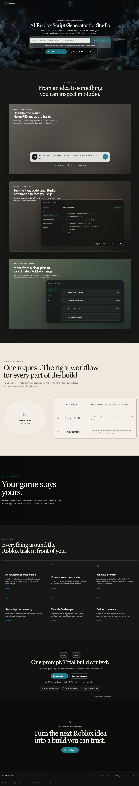

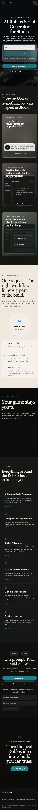

#### Product

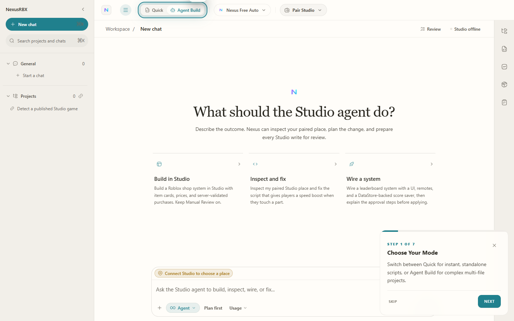

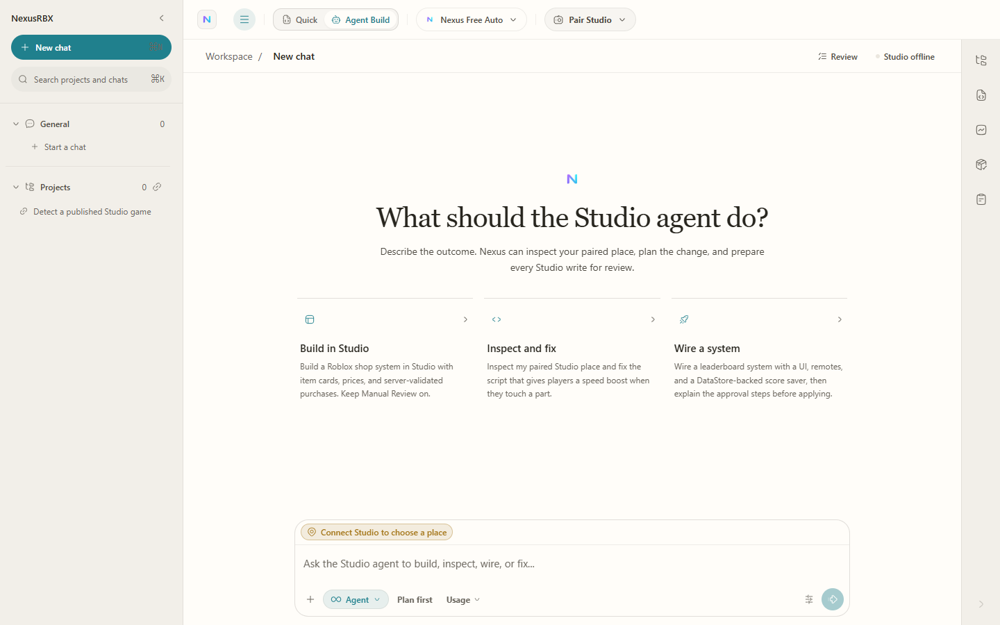

### What is working and should survive

- The product already has a believable application structure rather than a single chat box.
- The left project/chat navigation establishes persistence and project memory.
- Quick and Agent modes communicate that there are different depths of work.
- The bottom composer is a familiar, low-friction anchor.
- The right tool rail can become an efficient gateway to assets, scripts, theme, and project settings.
- The current site has enough content depth to support a strong story once its hierarchy is simplified.

### What is actively hurting the product

1. **The promise is too small.** “Script generator” makes NexusRBX sound like a thin wrapper at the exact moment Roblox is shipping native planning, code, asset, MCP, and playtest assistance.
2. **The art direction contradicts the audience.** The current dark, serious, cinematic treatment communicates enterprise AI or luxury software. The product is supposed to unlock imaginative Roblox game creation.
3. **The homepage describes capabilities instead of showing outcomes.** Users do not immediately see an obby, tycoon, social world, racing game, or another genre becoming real.
4. **There is no memorable brand mechanism.** Cards, blurred surfaces, and cinematic images can be competent, but they are not ownable.
5. **The first screen asks users to choose too much.** The prompt, workspace CTA, and connector CTA should not share equal weight.
6. **Long repeated card sections flatten the story.** Every section has similar visual weight, so scrolling does not feel like progress.
7. **The workspace wastes its most valuable area.** A giant empty canvas suggests the product has nothing to show until the user types. It should preview a plan, a project state, a Studio connection, and an obvious next action.
8. **The onboarding tour blocks the interface.** Activation should happen through a first small success, with contextual prompts instead of a modal tour explaining seven areas in advance.
9. **The current token system is difficult to rebrand.** Shared tokens exist, but the marketing CSS also contains many local overrides and hard-coded colors. A later implementation should establish semantic tokens before reskinning screens.
10. **The creator-economy promise is absent or risks becoming hype.** “Make Robux” can attract attention, but a get-rich-quick tone would destroy trust with experienced developers.

## 3. Research findings

### Roblox is becoming the baseline competitor

Roblox now positions its own AI workflow as a path from ideas to published games. Assistant can create and modify scripts and objects, use Creator Store assets, generate 3D objects, plan multi-step work, and support playtest-driven workflows. Studio MCP also gives external tools structured access to inspect, edit, run, and test experiences.

Sources:

- [Roblox: AI accelerated workflows](https://create.roblox.com/docs/ai/accelerated-workflows)
- [Roblox Assistant guide](https://create.roblox.com/docs/assistant/guide)
- [Roblox Studio MCP](https://create.roblox.com/docs/studio/mcp)
- [Roblox Creator Roadmap](https://create.roblox.com/updates/roadmap)
- [Planning Mode announcement](https://devforum.roblox.com/t/announcing-planning-mode-for-roblox-assistant/4580715)

**Strategic consequence:** NexusRBX cannot win by saying “we write Roblox scripts with AI.” It should win by making the whole project understandable and controllable:

- persistent whole-game memory across sessions and places;
- a visible plan before changes;
- multi-file changes with review, diff, approval, undo, and snapshots;
- Studio connection and playtest evidence;
- assets and UI in the same workflow;
- publish readiness;
- Roblox-native monetization and live-ops guidance;
- one clear path from idea to first player.

### What creators actually distrust

Reddit is directional evidence rather than a representative survey, but the same themes repeat:

- AI is useful for debugging, repetitive tasks, and speed, but it is not trusted as a magic whole-game button.
- Whole-project context and live Studio verification matter more than receiving a large code dump.
- Creators want to review changes and understand what failed.
- Setup and MCP reliability can be a source of frustration.
- A game can receive visits and still make little or no money.
- Fun, polish, retention, updates, distribution, and monetization design are separate jobs.
- Communities quickly reject low-effort “AI slop,” copied ideas, pay-to-win systems, and guaranteed-income language.

Representative threads:

- [Does anyone actually use the built-in AI Assistant?](https://www.reddit.com/r/robloxgamedev/comments/1ohijjo/does_anyone_actually_use_the_inbuilt_ai_assistant/)
- [Do you code games yourself or use AI?](https://www.reddit.com/r/robloxgamedev/comments/1ux4ql4/do_you_code_your_games_yourself_or_use_ai_to_help/)
- [Best way to create a Roblox game with AI](https://www.reddit.com/r/robloxgamedev/comments/1rwhy8o/best_way_to_create_a_roblox_game_with_ai/)
- [Thoughts on people using AI](https://www.reddit.com/r/robloxgamedev/comments/1qeeraa/whats_your_thoughts_on_people_using_ai_for/)
- [Roblox developers who make money: what works?](https://www.reddit.com/r/robloxgamedev/comments/1v5yrgx/roblox_developers_who_actually_make_money_what/)
- [Have you made money from a Roblox game?](https://www.reddit.com/r/robloxgamedev/comments/1rx2uqf/have_you_guys_made_any_money_off_of_a_roblox_game/)
- [Great retention, near-zero monetization](https://www.reddit.com/r/robloxgamedev/comments/1u0b2r8/great_retention_near_zero_monetization_where_do_i/)
- [How hard is it to make money on Roblox?](https://www.reddit.com/r/robloxgamedev/comments/1t3fwki/how_hard_is_it_to_actually_making_money_on_roblox/)

**Product response:** sell leverage with control, not automation without ownership. The interface should continuously answer:

1. What is the agent planning?
2. What did it change?
3. Did the game run?
4. What should I review?
5. What should I build next?

### Robux messaging must connect to real systems

Roblox monetization includes passes, developer products, subscriptions, Creator Rewards, and related systems. Its analytics guidance separates revenue, payer conversion, ARPPU, and ARPDAU. This supports a much stronger and more truthful story than “press a button and get Robux.”

Sources:

- [Roblox monetization overview](https://create.roblox.com/docs/get-started/monetization)
- [Roblox monetization analytics](https://create.roblox.com/docs/production/analytics/monetization)
- [Roblox subscriptions](https://create.roblox.com/docs/production/monetization/subscriptions)

Approved message territory:

- “Your game. Your upside.”
- “Build games players want. Add passes, products, and subscriptions when the experience is ready.”
- “Turn player feedback into the next update.”
- “Design the loop, test the fun, then build the economy.”

Message territory to reject:

- “Generate a game and make Robux instantly.”
- Earnings claims without proof and context.
- Revenue screenshots without costs, active-player context, or a clear source.
- Cash, luxury, rocket, or get-rich iconography.

## 4. Competitive and reference scan

### Product references

| Reference | What to learn | What not to copy |
| --- | --- | --- |
| [GDevelop](https://gdevelop.io/) | Leads with the outcome of making and publishing games and shows actual game art. | Its busy carousel/hero and dark game collage should not become NexusRBX’s identity. |
| [JellyBuild](https://jellybuild.com/) | Makes the Roblox-builder category immediately obvious and connects to a plugin. | The familiar AI-tool presentation is not differentiated enough. |
| [Orion](https://www.get-orion.com/) | Emphasizes project-tree context, scripts, playtests, screenshots, and profiling. | Do not compete through a longer checklist of AI features alone. |
| [BloxSmith](https://bloxsmith.pro/) | Simple “AI Roblox game builder” category language. | Avoid “free magic builder” framing that attracts low-intent expectations. |
| [WEPPY](https://weppyai.com/) | Strong emphasis on agents building while the creator remains in control, plus multi-place and validation workflows. | Do not mirror its visual treatment or feature ordering. |

### Visual references saved with the project

These are reference captures, not screens to clone.

#### GDevelop — outcome framing and real game variety

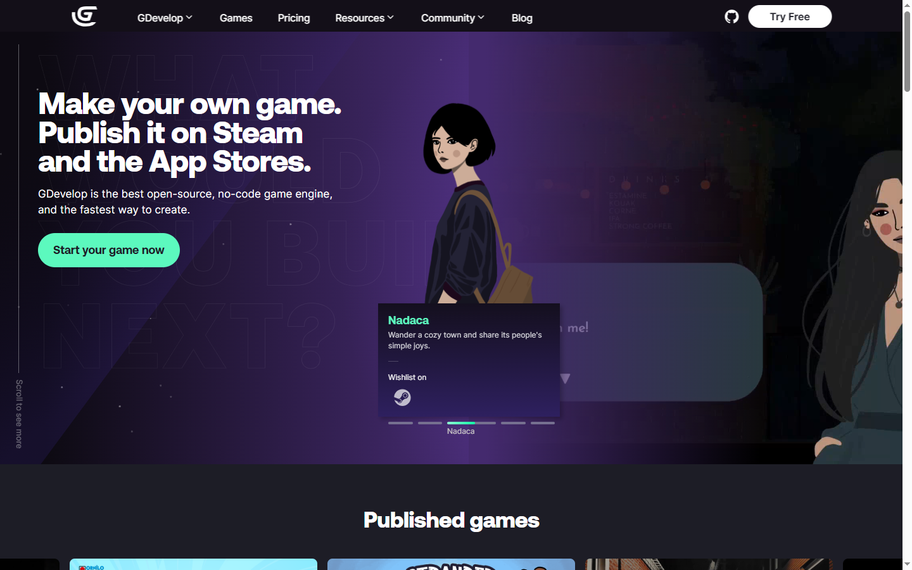

Borrow: visible game outcomes, credibility through breadth, clear creation/publishing promise.
Reject: dark slideshow energy and competing hero imagery.

#### Lottielab — purple hierarchy and breathing room

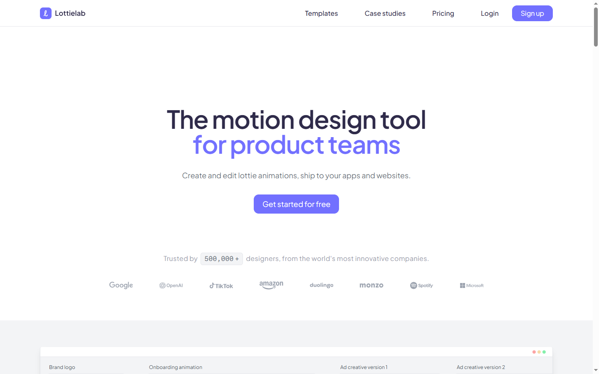

Borrow: clean purple focus, obvious CTA hierarchy, generous negative space.
Reject: generic sparse SaaS treatment as the final identity.

#### Comotion — bold purple blocks and an organic visual path

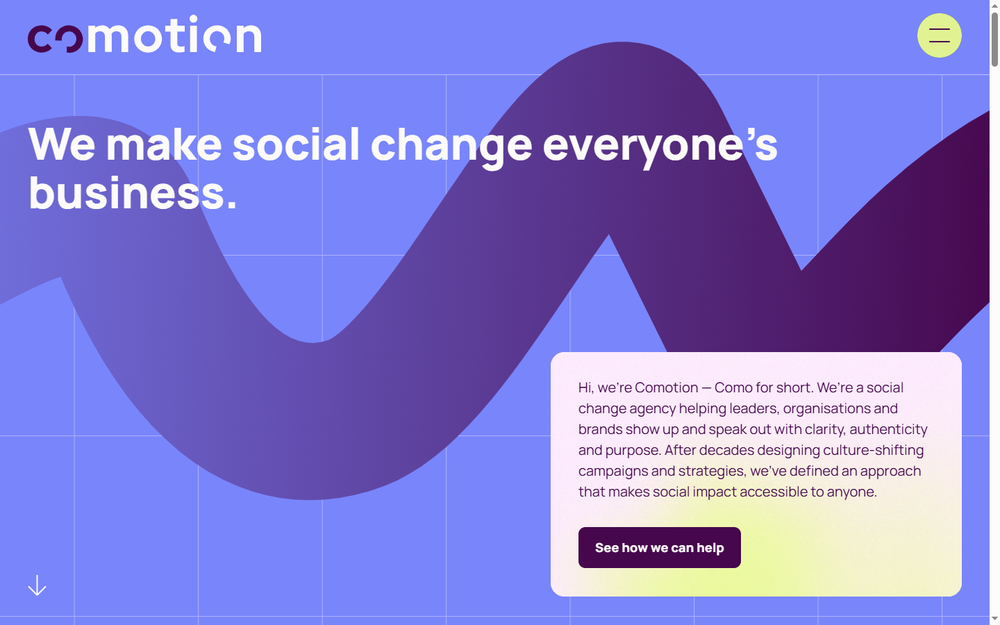

Borrow: high-confidence purple, oversized type, energetic path language, and modular storytelling.
Reject: its exact shapes, illustrations, or agency-style composition.

#### Deluxbury — tactile type and handmade texture

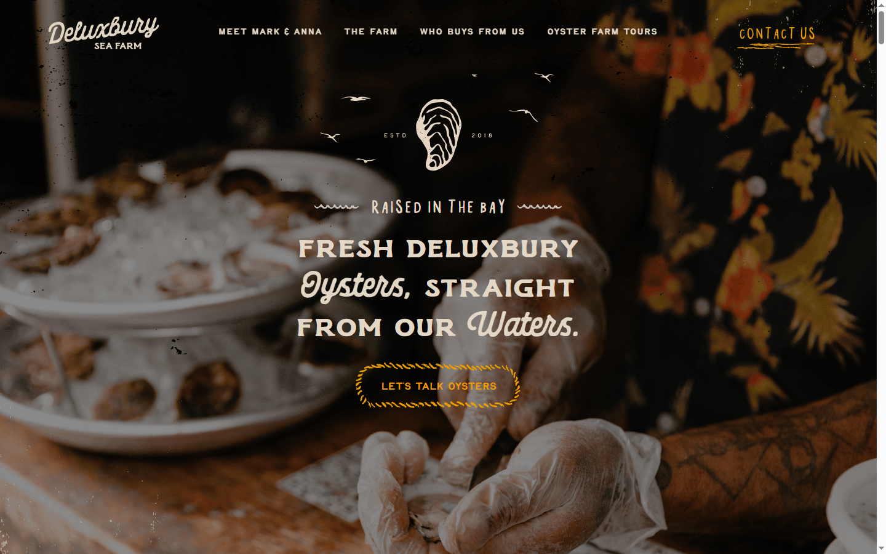

Borrow: texture, imperfection, and a sense that the interface was made by a person.
Reject: photo-led darkness and decorative lettering for interface copy.

Additional motion reference:

- [Rive interactive website animation](https://rive.app/use-cases/websites)

### Design-community warning

Web-design discussions repeatedly complain that current SaaS sites look like minimally edited templates, while also warning that uncontrolled hand-drawn interfaces become noisy and difficult to scale.

- [What happened to hand-drawn web aesthetics?](https://www.reddit.com/r/web_design/comments/1rzbt45/whatever_happened_to_handdrawn_web_aesthetics/)
- [Why do all modern SaaS websites look the same?](https://www.reddit.com/r/webdesign/comments/1oo9sa7/why_do_all_modern_saas_websites_look_the_same/)
- [What trend instantly makes a website feel dated?](https://www.reddit.com/r/web_design/comments/1tn4qgm/what_web_design_trend_instantly_makes_a_website/)
- [Playful design can overwhelm interaction](https://www.reddit.com/r/design_critiques/comments/10x79z7)

The right answer is a hybrid:

- expressive, illustrated marketing;
- highly legible, restrained product UI;
- one ownable motion/shape system across both;
- familiar interaction patterns underneath.

## 5. Recommended visual system

### Art-direction name: Cartoon Creator Workshop

This should feel like a serious game-building desk covered in sketches, playable worlds, sticky notes, scripts, and creator-economy tools—not a preschool app and not a cyberpunk AI dashboard.

### Core palette

| Token | Proposed value | Use |
| --- | --- | --- |
| Brand violet | #7C3AED | Primary CTA, active state, signature ribbon |
| Violet hover | #6D28D9 | Button hover/pressed hierarchy |
| Deep plum | #2E1065 | Dark sections, display accents |
| Aubergine | #160B24 | Optional dark product shell |
| Ink | #17121B | Text, outlines, high-contrast icons |
| Paper | #FFF8E7 | Main warm background |
| Surface | #FFFCF5 | Cards and input surfaces |
| Pale lavender | #EEE7FF | Selected and secondary surfaces |
| Soft violet | #A78BFA | Diagrams and secondary emphasis |
| Acid lime | #D9FF57 | Success, connected, completion accents |
| Coral | #FF6B6B | Sparks, warnings, celebratory micro-accents |

Rules:

- Remove blue and teal from the brand system.
- Do not recolor semantic errors, warnings, and successes purple. Meaning must remain distinguishable.
- Use violet as the main action color, not on every surface.
- Use acid lime and coral at low volume so purple remains dominant.
- Test final token pairs against WCAG rather than trusting concept-art color values.

### Typography

- Display: [Bricolage Grotesque](https://fonts.google.com/specimen/Bricolage+Grotesque)
- UI/body: [Instrument Sans](https://fonts.google.com/specimen/Instrument+Sans)
- Code/data: [JetBrains Mono](https://fonts.google.com/specimen/JetBrains+Mono)

Bricolage has personality without becoming a novelty font. Instrument Sans keeps dense product views calm. JetBrains Mono makes scripts, diffs, IDs, and measurements feel deliberate.

### Shape and texture

- 2 px near-black outlines on expressive marketing components.
- Slightly imperfect 12–20 px corner radii; no random shape language.
- 4 px hard offset shadows for large buttons and “sticker” objects.
- Fine paper grain and halftone fields at very low opacity.
- Flat fills with limited two-tone shading.
- No glassmorphism, glossy 3D, generic aurora gradients, or neon-blue AI glow.

### Ownable brand device: the Nexus Ribbon

A thick hand-drawn violet line becomes:

- the underline beneath the hero promise;
- the path connecting idea, build, playtest, publish, and grow;
- the agent-progress indicator in the workspace;
- the connector between a plan item and its changed files;
- a scroll cue and section transition;
- a success loop around a published game;
- the basis of a small animated loading mark.

This is more scalable than relying on a mascot. It can be loud on marketing pages and compact inside the workspace.

### Illustration system

- Tiny genre worlds, not copied Roblox avatars or logos.
- Blocky geometry, but original character silhouettes.
- Chunky ink outlines, imperfect print registration, and sticker cut lines.
- Visual storytelling must show cause and effect: prompt enters, plan appears, game is built, bug is found, fix is verified.
- Use a consistent top-left light source and limited shade values.
- Keep key art modular so the same world can become a hero image, card thumbnail, onboarding visual, and empty state.

## 6. Higgsfield art-direction studies

These concepts were generated to establish the theme. They are not final screen specifications; their purpose is to test brand energy, palette, hierarchy, and visual storytelling.

### A. Landing page — “Make any Roblox game”

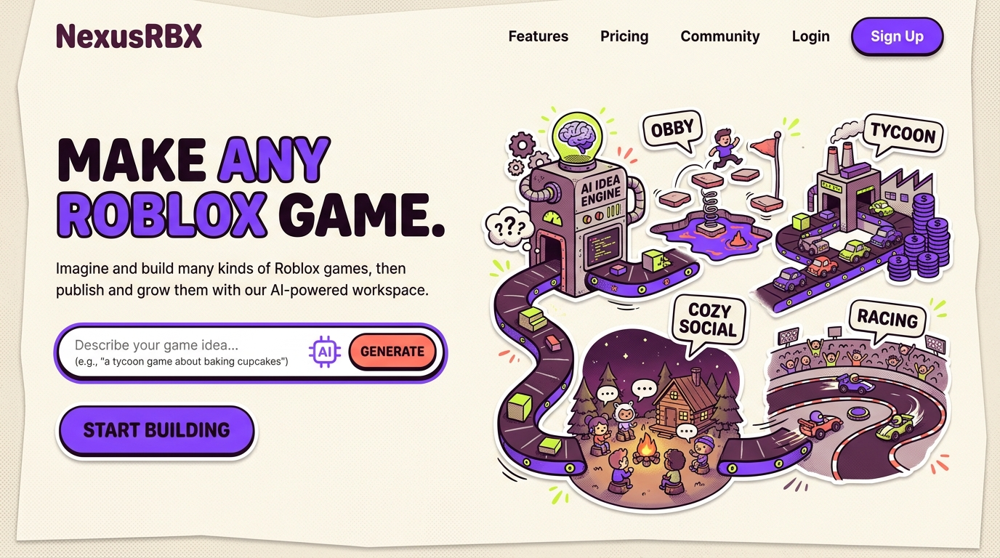

Keep:

- cream/purple/ink palette;
- immediate genre breadth;
- big, readable promise;
- workshop/conveyor metaphor;
- tactile outlined CTA.

Adapted during implementation:

- remove the redundant second CTA and let the prompt itself be the dominant action;
- use real product proof directly below the fold;
- ensure the illustration does not overpower the prompt on smaller laptops;
- use original NexusRBX game examples once available.

### B. Workspace — preserved structure, stronger hierarchy

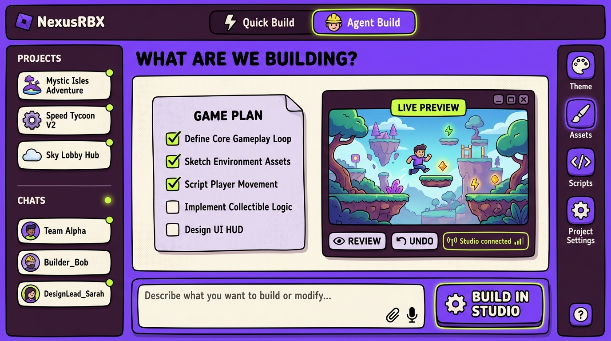

Keep:

- left navigation, top mode control, center canvas, bottom composer, right tool rail;
- plan and live preview sharing the canvas;
- visible review, undo, and Studio-connected state;
- restrained sticker-like file and status elements.

Adapted during implementation:

- reduce the saturation and outline weight by roughly 30% in dense workspace views;
- add text labels/tooltips for all icon-only controls;
- avoid treating every panel as equally loud;
- keep code and diff views visually neutral.

### C. Creator journey — idea to creator upside

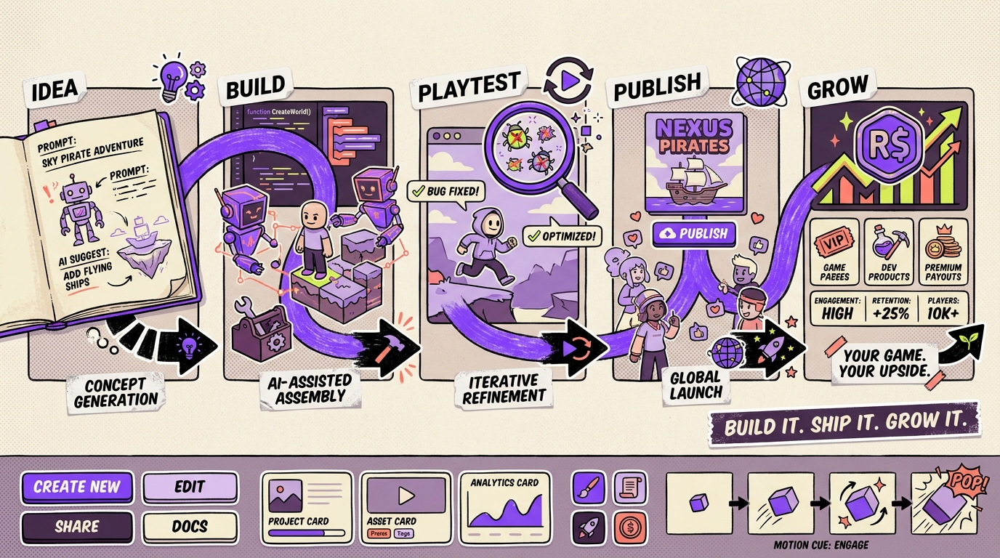

Keep:

- the continuous Nexus Ribbon;
- idea → build → playtest → publish → grow narrative;
- creator ownership language;
- monetization shown as systems and metrics, not cash fantasy.

Adapted during implementation:

- replace fictional success figures with either clearly labeled examples or real verified results;
- make the publish and grow steps accessible to users who are not ready to monetize;
- use this as a section rhythm, not one giant image.

### Generation prompt record

The three Higgsfield prompts explicitly requested:

1. A high-fidelity landing hero with a warm paper background, electric violet dominant color, an idea engine producing an obby, tycoon, cozy social world, and racing game, plus the line “MAKE ANY ROBLOX GAME.”
2. A high-fidelity workspace preserving the current five-part structure, with a game plan, live playtest, review/undo controls, and a visible Studio-connected state.
3. A horizontal idea → build → playtest → publish → grow theme board, connected by a hand-drawn violet path and ending with transparent monetization and engagement tools.

All prompts excluded blue/teal, glossy 3D, glassmorphism, generic AI gradients, copied Roblox branding, and get-rich-quick imagery.

## 7. Positioning and copy architecture

### Category

**AI Roblox game-building workspace** is clear enough for first-time visitors.
**Creator operating system for Roblox** is the stronger long-term internal positioning.

### Homepage copy hierarchy

Eyebrow:

> From idea to a playable Roblox game

Hero:

> **Make the Roblox game in your head.**

Support:

> Plan the whole project, build it in Studio, playtest every change, and add Roblox-native monetization when the experience is ready.

Prompt examples:

- “Build a co-op pizza tycoon with upgradeable kitchens.”
- “Make a round-based horror game set in a broken arcade.”
- “Create a cozy social island with fishing and house decorating.”
- “Prototype a gravity-switching obby with daily challenges.”

Primary action:

> Start with an idea

Secondary action:

> Watch a real build

Do not make “connect Studio” a hero-level competing CTA. It belongs immediately after the user commits to a build or inside a short guided product demo.

### Supporting claims

- “One project, every script, asset, and change.”
- “See the plan before the agent builds.”
- “Playtest the change, not just the code.”
- “Review, undo, and keep control.”
- “Build the fun first. Add the economy when it is ready.”
- “Your game. Your upside.”

## 8. Homepage layout plan

### 1. Sticky navigation

- Logo.
- Product.
- Games/examples.
- How it works.
- Pricing.
- Docs/downloads under a compact Resources menu.
- Sign in.
- One primary “Start building” button.

Use a warm paper bar with a subtle ink rule. Do not put every current destination at the top level.

### 2. Hero

Desktop:

- Left 48%: promise, support, prompt composer, one trust line.
- Right 52%: illustrated workshop producing multiple genre worlds.
- A violet ribbon begins at the prompt and enters the workshop.

Mobile:

- Promise first.
- Composer second.
- A simplified horizontal genre strip third.
- No full-height hero and no tiny decorative labels.

### 3. “Any game” genre parade

An interactive but accessible row of six genre cards:

- Obby.
- Tycoon.
- Horror.
- Social/cozy.
- Racing.
- RPG/adventure.

Selecting a genre updates the example prompt and the nearby build outcome. This is the first proof of breadth.

### 4. Real product demo

Show one continuous workflow:

1. A user describes a game.
2. NexusRBX proposes a plan.
3. The user approves a step.
4. Files change.
5. Studio runs a playtest.
6. A bug is found and corrected.

Use a real captured product sequence when available. A cinematic illustration is not enough here.

### 5. Why NexusRBX instead of another assistant

Four high-confidence differences:

- Whole-project context.
- Reviewable multi-file changes.
- Studio-connected playtest proof.
- From prototype to publish and live ops.

This section should be comparative in substance but should not attack Roblox.

### 6. Creator control and trust

Show:

- plan approval;
- change diff;
- snapshot/undo;
- playtest result;
- data/privacy summary.

The visual should move from rough idea to verified result, not from prompt to magical finished game.

### 7. Creator upside

A four-step loop:

> Fun → Retention → Monetize → Learn and update

Show Roblox-native options such as passes, developer products, subscriptions, and Creator Rewards, then show the metrics that inform iteration. Make it explicit that results depend on the experience and its audience.

### 8. Community proof

Only use verified proof:

- playable experiences;
- short creator quotes with identity/context;
- before-and-after time or quality improvements;
- published update cadence;
- player or engagement figures with dates and definitions.

If real proof is not ready, ship curated example builds labeled “Built with NexusRBX” rather than invented testimonials.

### 9. Pricing preview

Keep three plans at most. Explain limits in creator language:

- active projects;
- agent build usage;
- playtest/Studio features;
- asset generation;
- collaboration.

Avoid leading with model names or token accounting.

### 10. Final CTA and footer

Repeat the prompt composer in a simpler form:

> What game are we building?

The footer can hold the full current documentation, download, legal, support, and community structure.

## 9. Workspace layout polish

The workspace should be redesigned, not rebuilt from scratch.

### Persistent frame

#### Left sidebar — retain

- Projects.
- Search.
- Recent chats/builds.
- New project.
- Collapsible at tablet widths.
- Project thumbnails use tiny world art, not generic gradients.

#### Top bar — retain and clarify

- Project breadcrumb and current place.
- Connection state.
- Mode selector.
- Review queue count.
- Run/playtest.

Rename modes if testing confirms confusion:

- “Quick Script” for a focused request.
- “Project Build” for planned multi-step work.

“Quick” and “Agent Build” can remain if concise descriptions are displayed at first use.

#### Center build canvas — major polish

Default project state:

- current goal;
- short plan;
- live Studio/game preview or last captured state;
- recent changes;
- obvious next action.

During a build:

- ribbon-style progress through plan steps;
- current tool/action;
- changed files;
- approvals;
- test result.

After a build:

- outcome summary;
- review diff;
- playtest evidence;
- undo/snapshot;
- suggested next step.

The center must never be a blank desert.

#### Bottom composer — retain as the anchor

- Plain-language placeholder.
- Add/attach context.
- Mode-aware submit action.
- Clear state when Studio is disconnected.
- Suggested prompts are short chips, not a large empty-state essay.

#### Right tool rail — retain, make legible

Group into:

- Build: plan, scripts, UI.
- Create: assets, icons, theme.
- Ship: tests, publish readiness.
- Grow: monetization, analytics.
- Project: settings and history.

Every icon gets a label or accessible tooltip. Opening a tool creates a predictable drawer instead of a different layout for every feature.

### Onboarding

Replace the blocking multi-step tour with:

1. Choose or describe a tiny first project.
2. Connect Studio only when the first build needs it.
3. Approve a three-step plan.
4. Run one small change.
5. Celebrate a verified playtest.

This creates confidence through success rather than explanation.

### Responsive behavior

- Desktop 1280 px and above: full five-part frame.
- Small desktop/tablet landscape: collapsed project rail and one expandable tool drawer.
- Tablet portrait: canvas plus composer; navigation becomes a sheet.
- Mobile: project status, chat, approvals, review, and notifications. Do not pretend a phone is a full Monaco/Studio authoring environment.

## 10. Motion and effects plan

The user asked for “a lot of effects.” The site can feel alive without making every object move.

### Signature effects

- Nexus Ribbon draws from prompt to outcome.
- Hero workshop produces one tiny genre world at a time.
- Genre cards change the prompt and illustration through a short shared transition.
- Sticker cards tilt by no more than 1–1.5 degrees on pointer hover.
- Buttons compress their hard shadow from 4 px to 2 px on press.
- Agent progress travels along the ribbon from plan to file to Studio.
- A successful playtest receives a small ink-stamp animation.
- Section transitions use print registration, draw-on arrows, and paper-layer reveals.

### Motion rules

- One spectacle per section.
- Routine UI feedback: 150–220 ms.
- Panel transitions: 220–300 ms.
- Transform and opacity first; avoid layout-heavy animation.
- No infinite motion near text fields, code, or pricing.
- Pointer parallax only in the hero, with a very small range.
- Respect reduced-motion preferences with static final states.
- Effects must not delay typing, submitting, reviewing, or navigating.

## 11. Shared design-system plan

Before page-by-page redesign, establish:

- semantic colors rather than raw color names;
- typography roles;
- spacing scale;
- outline and shadow tokens;
- radii;
- motion duration/easing;
- elevation and focus-ring rules;
- light paper and dark aubergine surface themes;
- illustration and icon guidelines.

Core components:

- primary, secondary, ghost, and destructive buttons;
- prompt composer;
- project/game card;
- genre card;
- status badge;
- connection pill;
- plan step;
- file/change chip;
- diff/review panel;
- playtest result;
- drawer and tooltip;
- toast and success stamp;
- skeleton/empty/error states.

Marketing can use the fullest cartoon treatment. Dense code, settings, billing, and data tables should use the same palette and typography with quieter borders and almost no texture.

## 12. Full product scope

The implemented redesign covers:

- Site shell, homepage, examples, pricing, downloads, docs entry pages, and footer.
- Sign in, account creation, onboarding, and Studio pairing.
- AI workspace and project history.
- Asset/icon tools and Creator Store workflows.
- Pricing, usage, billing, and plan changes.
- Settings, support, errors, offline/disconnected states, and account management.
- Shared tokens, components, icons, illustration, motion, and responsive behavior.

The shared system and core workspace frame were established first, then carried through these surfaces without changing the product's runtime architecture.

## 13. Phased implementation roadmap

This roadmap now serves as implementation history plus the remaining product path. The foundation, site shell/homepage, onboarding, workspace, Creator Store, account surfaces, production proof assets, optimized builds, automated suites, and integrated Chromium QA are complete. Publish-readiness features, growth tooling, and dedicated cross-browser/assistive-technology QA remain.

### Phase 0 — baseline and inventory

- Fix the current compile blocker.
- Capture every route at desktop, tablet, and mobile.
- Inventory shared components and hard-coded styling.
- Establish current conversion and activation events.
- Confirm which screenshots, creator builds, and revenue/engagement claims can be used as proof.

Exit: the current app builds cleanly and every redesign surface is accounted for.

### Phase 1 — foundation and prototypes

- Implement semantic purple tokens, typography, focus states, surfaces, shadows, and motion primitives.
- Build the Nexus Ribbon as a lightweight SVG/Rive-compatible system.
- Produce high-fidelity responsive prototypes for the homepage and workspace.
- User-test the core promise, mode labels, and prompt-to-first-success flow.

Exit: the visual system is approved in both expressive marketing and dense product contexts.

### Phase 2 — site shell and homepage

- Redesign navigation/footer.
- Build hero, genre proof, product demo, differentiation, trust, creator-upside, proof, pricing preview, and final CTA.
- Replace concept illustrations with production assets.
- Add analytics for prompt interaction, CTA, demo completion, and Studio-connect intent.

Exit: visitors understand the product, see proof, and have one clear next action.

### Phase 3 — onboarding and pairing

- Replace the blocking tour.
- Create the tiny-first-success flow.
- Improve Studio pairing feedback, recovery, and connection states.
- Add example projects by genre.

Exit: a new user reaches a verified first change with minimal confusion.

### Phase 4 — workspace visual hierarchy

- Apply the refined frame while retaining the current structure.
- Build plan, progress, changes, review, playtest, and outcome states.
- Clarify modes and tool rail.
- Improve empty, loading, error, disconnected, and approval states.

Exit: creators always know what is happening, what changed, and what to do next.

### Phase 5 — assets, market, and growth tools

- Unify asset generation and Creator Store workflows.
- Introduce publish-readiness checks.
- Add Roblox-native monetization planning and metric education.
- Keep creator-control and transparent-value principles throughout.

Exit: the “build it, ship it, grow it” promise exists inside the product, not only in marketing.

### Phase 6 — remaining account surfaces

- Pricing, usage, billing, settings, support, and account management.
- Quiet the visual treatment for data-heavy pages while retaining the brand.

Exit: no legacy teal/blue or mismatched typography remains.

### Phase 7 — accessibility, performance, and polish

- Keyboard, screen-reader, contrast, zoom, and reduced-motion QA.
- Cross-browser and device testing.
- Image and animation budgets.
- Funnel review and copy experiments.
- Final consistency audit.

Exit: the experience is expressive, fast, understandable, and production-ready.

## 14. Acceptance criteria

### Brand and comprehension

- In a five-second test, users can say NexusRBX helps them make Roblox games, not only scripts.
- Users can identify at least three supported game genres from the first two sections.
- Purple is clearly the primary brand color; teal/blue is absent from brand actions and decorative UI.
- The Nexus Ribbon is recognizable across marketing and product without dominating dense screens.

### Conversion

- The hero has one dominant action.
- A visitor can see a real prompt-to-playtest flow before pricing.
- Studio connection appears at the moment it is needed, not as a competing hero CTA.
- Creator-upside language is compelling without implying guaranteed Robux.

### Product usability

- A creator can identify the current project, connected place, active mode, plan state, changed files, and review status without opening a menu.
- Every icon-only tool has a label or accessible tooltip.
- Undo/snapshot and playtest evidence are visible after material changes.
- No core workspace state presents a giant unexplained empty canvas.

### Accessibility and performance

- WCAG AA contrast for body copy, controls, and focus states.
- Complete keyboard access and visible focus.
- Controls meet practical touch-target sizing.
- Reduced-motion users receive a complete static experience.
- Marketing effects do not block interaction or cause layout shift.
- Production image and animation budgets are defined before asset export.

## 15. Risks and guardrails

| Risk | Guardrail |
| --- | --- |
| Cartoon style makes the product feel childish | Use bold illustration in marketing; keep code, review, settings, and analytics surfaces restrained. |
| Too many effects reduce trust or performance | One spectacle per section, motion budgets, reduced-motion support, and no infinite UI motion. |
| Purple becomes another generic AI gradient | Use flat violet, warm paper, ink, halftone, and the ownable Ribbon system. |
| “Make any game” feels unbelievable | Pair the claim with genre examples, a real build demo, and clearly stated current limits. |
| Robux promise feels like a scam | Show real monetization systems, honest metrics, verified proof, and no guaranteed-outcome language. |
| Native Roblox Assistant catches up | Position around project orchestration, reviewability, playtest evidence, publish readiness, and live ops. |
| Redesign scope expands endlessly | Approve tokens, homepage, and core workspace first; derive the rest from those systems. |
| Existing structure gets lost | Treat the sidebar, mode bar, canvas, composer, and tool rail as fixed anchors unless user testing disproves them. |

## 16. Decisions locked for the next phase

- **Purple replaces blue/teal as the brand color.**
- **The majority of the current workspace structure stays.**
- **The layout gets a hierarchy and spacing polish, not a gratuitous reinvention.**
- **The visual direction is original 2D cartoon editorial, not glossy 3D or cyberpunk AI.**
- **The Nexus Ribbon is the lead signature device.**
- **The promise expands from script generation to the full game lifecycle.**
- **Robux is framed as creator upside supported by real systems, never as a guarantee.**
- **The approved direction is implemented; further visual expansion should preserve the validated structure and semantic token system.**

## 17. Recommended next product phase

The redesign itself has passed its required implementation gates. The next phase should extend the product without weakening the honesty of the current experience:

1. complete manual Safari, Firefox, screen-reader, and high-zoom QA beyond the automated Chromium pass;
2. replace curated example briefs with named creator evidence only when permission and verifiable outcomes exist;
3. define publish-readiness checks as a separate feature, then validate them against the Studio bridge protocol;
4. add growth and monetization planning from Roblox Creator Analytics signals without promising player or Robux outcomes;
5. split the interactive homepage into a smaller client island if public-page hydration becomes a measured performance bottleneck.

This document now records a verified redesign implementation. It does not claim that publish automation, live operations, or guaranteed growth features exist.

## 18. Implementation record — 12 August 2026

### Shipped in the current shared worktree

- Established the warm-paper, plum, and violet semantic design system, canonical display/body/code font mappings, shared surface treatment, and the public-facing purple Nexus Ribbon mark.
- Reworked the site shell and homepage around “Make the Roblox game in your head,” prompt-led creation, multi-genre proof, creator upside, and a responsive editorial hierarchy while preserving the product’s core route structure.
- Tightened onboarding toward a shorter first-success path while retaining the existing tutorial behavior and recovery model.
- Polished the existing workspace architecture instead of replacing it: the initial sidebar now opens at desktop widths of at least 1200 px, the right drawer switches inline at approximately 1180 shell pixels, rail labels remain visible, and mobile actions meet the 44 px target.
- Replaced the oversized workspace desert with a compact “What are we building?” state. When authoritative controller data exists, it shows the current project, place, and Studio connection state; otherwise it keeps generic project/build cues.
- Preserved focus trapping/restoration and runtime APIs while adding clearer selected/collapsed semantics, including `aria-selected` and inert collapsed descendants where structurally appropriate.
- Unified the asset and icon experience under the visible “Creator Store” name, removed the nested fixed-height page scroll assumption, raised small labels/body copy to readable floors, tokenized preview backgrounds, and updated the workflow copy to the truthful upload → asset ID → reviewed snippet path.
- Carried the same token, typography, spacing, and responsive direction through the implemented authentication, settings, billing, downloads, pricing, legal, and support-adjacent surfaces without adding fictional Ship or Grow controls.

### Validation completed at this checkpoint

- The full optimized build passed for both frontends. The React application compiled, the Next public frontend compiled, all 188 static pages were generated, and the exports merged into the production build.
- The full React regression suite passed: 177 suites / 901 tests.
- Public raw-HTML contracts passed: 20 / 20.
- Production route ownership and canonical contracts passed: 24 / 24.
- The combined public editorial, pricing, Creator Store, homepage, and mobile activation contracts passed: 30 / 30.
- Required Studio protocol verification passed: 29 / 29, and `backend/server.js` passed its syntax check.
- Focused workspace, onboarding, homepage, authentication, billing, docs, and Creator Store suites also passed during implementation.
- Chromium browser QA covered 390, 768, 1024, 1199, 1200, and 1440 px widths. The homepage, AI workspace, sign-in, settings, pricing, docs, downloads, and legal surfaces had correct headings, no compile overlay, no horizontal overflow, and no broken production images.
- Mobile navigation, genre-to-prompt behavior, focus restoration, the 1199/1200 workspace boundary, 44 px critical touch targets, and reduced-motion behavior were exercised directly.
- The social preview is a production 1200 × 630 purple workshop image, and favicon/PWA raster assets now match their declared dimensions.

### Residual risk and pending verification

- The optimized React build emits one third-party warning because `rehype-harden` publishes a source-map reference to a missing TypeScript source file. The bundle and both production builds still complete successfully.
- Automated and manual Chromium checks are complete; a dedicated Safari, Firefox, VoiceOver/NVDA, and high-zoom pass remains future release hardening.
- The Next homepage currently hydrates the shared marketing component. Analytics loading is deferred until idle, but a smaller composer/genre client island remains a measured-performance optimization rather than a release blocker.
- Curated examples are deliberately labelled as examples, not testimonials. Named creator proof still requires permission and verifiable results.
- Publish readiness, live-ops, analytics, and growth/monetization planning remain roadmap work; this implementation deliberately does not invent unavailable controls or a new domain model.
- The downloads page intentionally fails closed while `/connector/latest.json` is absent. It exposes no unverified installer and presents the explicit unavailable state.
- The Creator Store still hands creators an editable Lua starting point through the existing export behavior. The revised copy is truthful; the complete upload, asset-ID, snippet-review, and Studio-use journey remains a separate product-flow test.

## 19. Final visual verification

These captures record the implemented purple creator-workshop system at the end of the Chromium QA pass.

### Production homepage

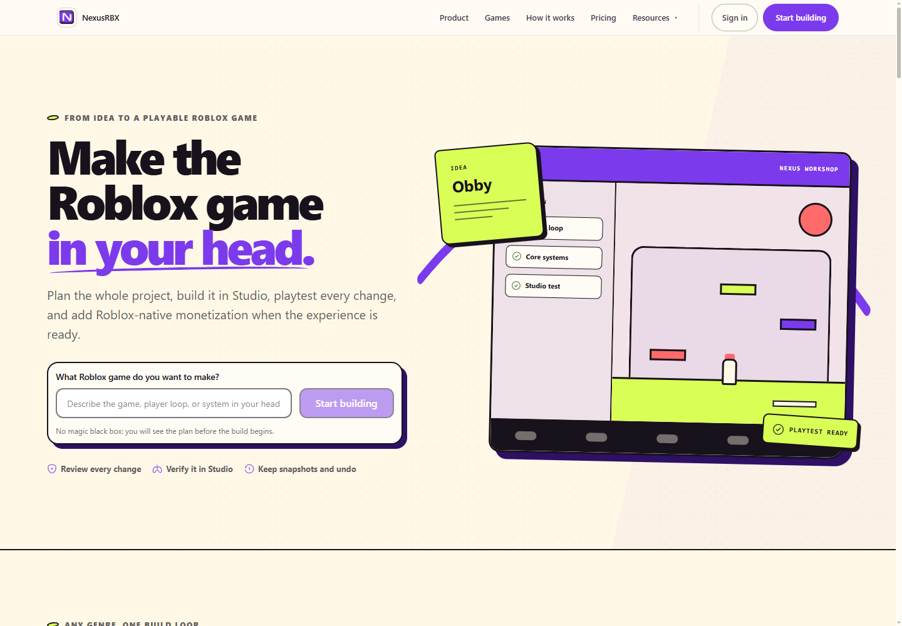

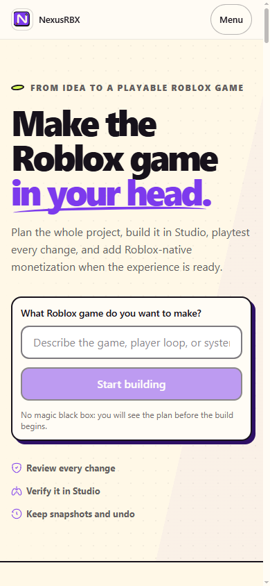

### AI workspace

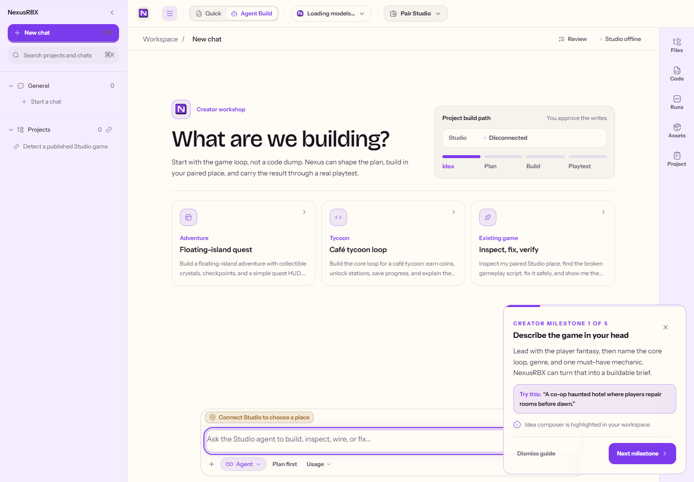

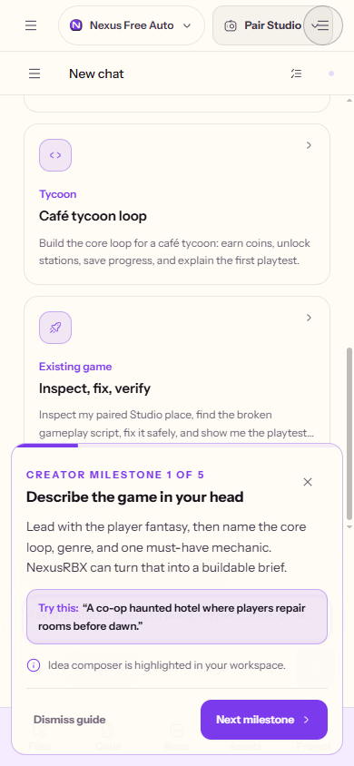

### Supporting surfaces

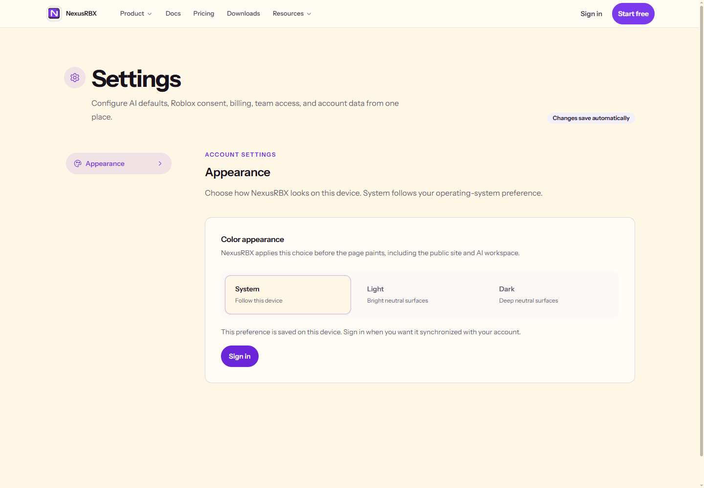

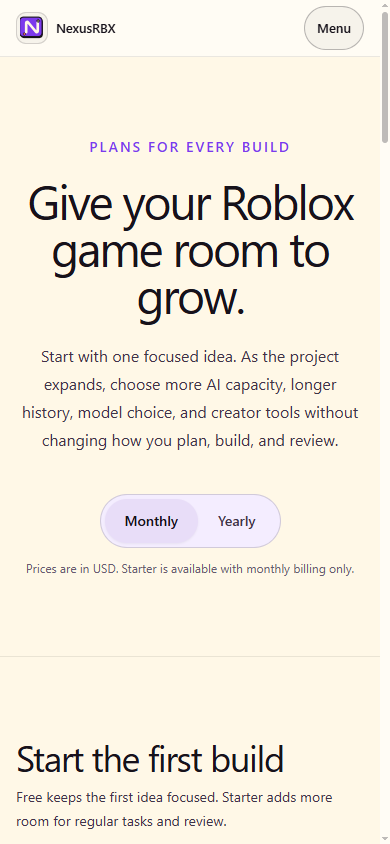
