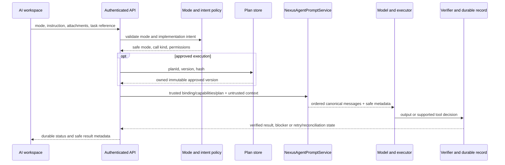

# Unified NexusRBX model-facing architecture

## Before and after

Before, Ask, artifact generation, Debug, Plan, Quick Script, Studio and legacy UI generation assembled independent identities, trust rules, output formats and completion claims. Approved plan text could be lost between approval and execution, while project-controlled material could be promoted into system messages.

After, every primary code-first path uses `NexusAgentPromptService`. Provider and executor adapters remain specialised, but prompt policy has one owner and a fixed layered envelope:

1. Stable NexusRBX identity and non-negotiable execution rules.
2. Trusted server-derived task binding and actual capability snapshot.
3. A mode contract for Ask, Plan, Agent, Debug, Quick Script or Studio Agent.
4. A separately delimited user message containing untrusted project, Studio, asset, conversation and attachment data.
5. The current user instruction in its own untrusted user section.
6. A separate executor/output contract.

Each assembly records a version, deterministic hash, section sizes, truncation/redaction metadata, binding summary, tool names, plan reference and verifier requirements. Production inspection exposes only this safe metadata.

## Request sequence

Short continuations bind to the active task or approved plan. Invalid, deleted or misspelled modes fail with a typed error where the API contract permits it, otherwise they degrade to read-only Ask; they never become Agent.

## Mode contract

| Mode | Behaviour | Completion boundary |
| --- | --- | --- |
| Ask | Conversational and strictly read-only; concise clarification is allowed | Explanation delivered; never claims a mutation |
| Plan | Creates a complete visible plan and waits for explicit approval | Immutable plan version stored; no build started |
| Agent | Plans internally and executes clear build intent using sensible defaults | Executor-specific validation passes or a typed blocker is returned |
| Debug | Reproduces/identifies the root cause and applies the smallest correct fix | Relevant inspection and validation pass; unrelated code preserved |
| Quick Script | Produces one focused script immediately | Single-script contract passes; structurally broad requests escalate |
| Studio Agent | Manifest-first targeted reads, supported writes only, reconciliation before uncertain retries | Command executed on expected target, validation/readback passed, diagnostics resolved and receipt durably stored |

Questions alone do not grant write authority. Custom modes may adjust tone or specialism only.

## Approved-plan continuity

The workflow service normalizes the plan, creates a deterministic hash, and stores immutable version 1. Approval stores the exact version/hash, timestamp and approving user. Amendments create another version. The browser sends only `{planId, version, hash}`. Before any artifact or task run starts, the backend reloads the plan and validates owner, status, version and hash. The job stores the exact trusted markdown, steps, assumptions, classification, scope and approval audit fields. Prompt assembly places that exact plan in a privileged trusted execution-contract section, and result metadata records the executed plan ID/version/hash.

No browser-supplied plan body is authoritative.

## Trust boundaries

System messages may contain only stable policy, server-derived bindings/capabilities, a server-loaded approved plan, mode behaviour and executor/output rules.

The following always remain untrusted user data, even when supplied by a tool: instructions, conversation history, filenames, names, source, manifests, attachments, base artifacts, Studio inspection/results, assets and custom-mode text. They are deterministically ordered, redacted, size-limited and enclosed in named `BEGIN_UNTRUSTED_*` / `END_UNTRUSTED_*` sections. Truncation is reported in safe metadata. Full hidden prompts, private source and raw attachments are not logged or exposed by the inspector.

## Studio completion semantics

The Studio protocol, leases, snapshots, expected source hashes, idempotency keys and receipts are unchanged. The canonical Studio envelope supplies only runtime-allowed tool names and bindings. MCP-only runs stay read-only. Delivery or acknowledgement is an intermediate state, not success. Unknown external write outcomes are reconciled against receipts/readback before retry, preventing duplicated mutations.

The global evaluation invariant is `unverifiedReportedCompleteCount === 0`.

## Legacy boundary

Board-state/UI Builder calls are explicitly marked legacy and mounted through one feature-gated boundary. They emit deprecation telemetry and response headers. Primary `/ai` paths do not import or route to legacy board-state builders. Removal can proceed only after route usage is measured.

